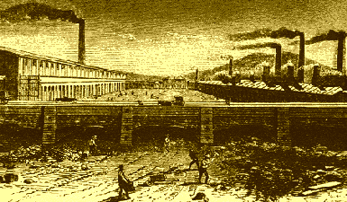

Works of Karl Marx 1847

# Wage Labour and Capital

------------------------------------------------------------------------

[Delivered:]{.info} December 1847;\
[Source:]{.info} Wage Labour and Capital, the original 1891 pamphlet;\
[Edited/Translated:]{.info} Frederick Engels;\
[First Published (in German):]{.info} *Neue Rheinische Zeitung*, April
5-8 and 11, 1849;\
[Online Version:]{.info} Marx/Engels Internet Archive (marxists.org)
1993, 1999;\
[Transcription/Markup:]{.info} Zodiac and [Brian
Baggins](../../../../../admin/volunteers/steering.htm#emeritus);\
[Proofed:]{.info} and corrected by Alek Blain, 2006.

{align="right" border="1" hspace="2"
vspace="2"}

------------------------------------------------------------------------

Table of Contents:

[Introduction](intro.htm)\
[Preliminary](ch01.htm)\
[What are wages?](ch02.htm)\
[By what is the price of a commodity determined?](ch03.htm)\
[By what are wages determined?](ch04.htm)\
[The nature and growth of capital](ch05.htm)\
[Relation of wage-labor to capital](ch06.htm)\
[The general law that determines the rise and fall of wages and
profit](ch07.htm)\
[The interests of capital and wage-labor are diametrically
opposed](ch08.htm)\
[Effect of capitalist competition on the capitalist class, middle class
and working class](ch09.htm)

\
\

------------------------------------------------------------------------

[Study Guide](guide.htm)\
[1847 Index](../index.htm) \| [1840s Index](../../date/1840s.htm) \|
[Marx-Engels Archive](../../../index.htm)
