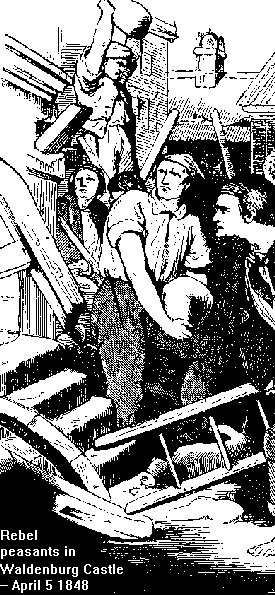

{.right}

The Peasant War in Germany by Frederick Engels

# Preface to the Second Edition (1870)

This work was written in London in the summer of 1850, under the vivid
impression of the counter-revolution that had just been completed. It
appeared in 1850 in the fifth and sixth issues of the *[Neue Rheinische
Zeitung](../../subject/newspapers/neue-rheinische-zeitung.htm)*, a
political economic review edited by Karl Marx in Hamburg. My political
friends in Germany desire to see it in book form, and I hereby fulfil
that desire, since, unfortunately, it still has the interest of
timeliness.

The work does not pretend to present independently collected material.
Quite the contrary, all the material relating to the peasant revolts and
to Thomas Muenzer has been taken from
Zimmermann^[\[1\]](notes.htm#1){#note1ref}^ whose book, although showing
gaps here and there, is still the best presentation of the facts.
Moreover, old Zimmermann enjoyed his subject. The same revolutionary
instinct which makes him here the advocate of the oppressed classes,
made him later one of the best in the extreme left wing of Frankfurt.

If, nevertheless, the Zimmermann representation lacks internal
coherence; if it does not succeed in showing the religious and political
controversies of that epoch as a reflection of the class struggles that
were taking place simultaneously; if it sees in the class struggles only
oppressors and oppressed, good and evil, and the final victory of evil;
if its insight into social conditions which determined both the outbreak
and the outcome of the struggle is extremely poor, it was the fault of
the time in which that book came into existence. Nevertheless, for its
time, and among the German idealistic works on history, it stands out as
written in a very realistic vein.

This book, while giving the historic course of the struggle only in its
outlines, undertakes to explain the origin of the peasant wars, the
attitude of the various parties which appear in the war, the political
and religious theories through which those parties strove to make clear
to themselves their position; and finally, the result of the struggle as
determined by the historical-social conditions of life, to show the
political constitution of Germany of that time, the revolt against it;
and to prove that the political and religious theories were not the
causes, but the result of that stage in the development of agriculture,
industry, land and waterways, commerce and finance, which then existed
in Germany. This, the only materialistic conception of history,
originates, not from myself but from Marx, and can be found in his works
on the French Revolution of 1848--9, published in the same review, and
in his *[Eighteenth Brumaire of Louis
Bonaparte](../../1852/18th-brumaire/index.htm)*.

The parallel between the German Revolutions of 1525 and of 1848--9 was
too obvious to be left entirely without attention. However, together
with an identity of events in both cases, as for instance, the
suppression of one local revolt after the other by the army of the
princes, together with a sometimes comic similitude in the behaviour of
the city middle-class, the difference is quite clear.

"Who profited by the Revolution of 1525? The princes. Who profited by
the Revolution of 1848? The big princes, Austria and Prussia. Behind the
princes of 1525 there stood the lower middle-class of the cities, held
chained by means of taxation. Behind the big princes of 1850, there
stood the modern big bourgeoisie, quickly subjugating them by means of
the State debt. Behind the big bourgeoisie stand the proletarians."

I am sorry to state that in this paragraph too much honour was given to
the German bourgeoisie. True, it had the opportunity of "quickly
subjugating" the monarchy by means of the State debt. Never did it avail
itself of this opportunity.

Austria fell as a boon into the lap of the bourgeoisie after the war of
1866, but the bourgeoisie does not understand how to govern. It is
powerless and inefficient in everything. Only one thing is it capable of
doing: to storm against the workers as soon as they begin to stir. It
remains at the helm only because the Hungarians need it.

And in Prussia? True, the State debt has increased by leaps and bounds.
The deficit has become a permanent feature. The State expenditures keep
growing, year in and year out. The bourgeoisie have a majority in the
Chamber. No taxes can be increased and no debts incurred without their
consent. But where is their power in the State? It was only a couple of
months ago, when a deficit was looming, that again they found themselves
in the most favourable position. They could have gained considerable
concessions by persevering. What was their reaction? They considered it
a sufficient concession when the Government allowed them to lay at its
feet nine millions, not for one year alone, but to be collected
indefinitely every year.

I do not want to blame the "national liberals" of the Chamber more than
is their due. I know they have been forsaken by those who stand behind
them, by the mass of the bourgeoisie. This mass does not wish to govern.
1848 is still in its bones.

Why the German bourgeoisie has developed this remarkable trait, will be
discussed later.

In general, however, the above quotation has proved perfectly true.
Beginning from 1850, the small States were in constant retreat, serving
only as levers for Prussian and Austrian intrigues. Austria and Prussia
were engaged in ever-stronger struggles for supremacy. Finally, the
fearful clash of 1866 took place. Austria, retaining all its provinces,
subjugated, directly and indirectly, the entire north of Prussia, while
leaving the fate of the three southern States in the air.

In all these grand activities of the States, only the following are of
particular importance for the German working class:

First, that universal suffrage has given the workers the power to be
directly represented in the legislative assemblies.

Second, that Prussia has set a good example by swallowing three crowns
by the grace of God. That after this operation her own crown is
maintained by the grace of God as pure as she claims it to be, not even
the national liberals believe any more.

Third, that there is only one serious enemy of the Revolution in Germany
at the present time -- the Prussian government.

Fourth, that the Austro-Germans will now be compelled to ask themselves
what they wish to be, Germans or Austrians; whom they wish to adhere to,
to Germany or her extraordinary transleithanian appendages. It has been
obvious for a long time that they will have to give up one or the other.
Still, this has been continually glossed over by the petty-bourgeois
democracy.

As to other important controversies concerning 1866 which were threshed
out between the "national-liberals" and the people's party *ad nauseam,*
coming years will show that the two standpoints fought so bitterly
simply because they were the opposite poles of the same stupidity.

In the social conditions of Germany, the year 1866 has changed almost
nothing. A few bourgeois reforms: uniform measures and weights, freedom
of movement, freedom of trade, etc. -- all within limits befitting
bureaucracy, do not even come up to that of which other western European
countries have been in possession for a long while, and leave the main
evil, the system of bureaucratic concessions, unshaken. As to the
proletariat, the freedom of movement, and of citizenship, the abolition
of passports and other such legislation is made illusory by the current
police practice.

What is much more important than the grand manoeuvres of the State in
1866 is the growth of German industry and commerce, of the railways, the
telegraph, and ocean steamship navigation since 1848. This progress may
be lagging behind that of England or even France, but it is unheard of
for Germany, and has done more in twenty years than would have been
previously possible in a century. Germany has been drawn, earnestly and
irrevocably, into world commerce. Capital invested in industry has
multiplied rapidly. The position of the bourgeoisie has improved
accordingly. The surest sign of industrial prosperity -- speculation --
has blossomed richly, princes and dukes being chained to its triumphal
chariot. German capital is now constructing Russian and Rumanian
railways, whereas, only fifteen years ago, the German railways went
a-begging to English entrepreneurs. How, then, is it possible that the
bourgeoisie has not conquered political power, that it behaves in so
cowardly a manner toward the government?

It is the misfortune of the German bourgeoisie to have come too late --
quite in accordance with the beloved German tradition. The period of its
ascendancy coincides with the time when the bourgeoisie of the other
western European countries is politically on the downward path. In
England, the bourgeoisie could place its real representative, Bright,
into the government only by extending the franchise which in the long
run is bound to put an end to its very domination. In France, the
bourgeoisie, which for two years only, 1849--50, had held power as a
class under the republican régime, was able to continue its social
existence only by transferring its power to Louis Bonaparte and the
army. Under present conditions of enormously increased interdependence
of the three most progressive European countries, it is no more possible
for the German bourgeoisie extensively to utilize its political power
while the same class has outlived itself in England and France. It is a
peculiarity of the bourgeoisie, distinguishing it from all other
classes, that a point is being reached in its development after which
every increase in its power, that is, every enlargement of its capital,
only tends to make it more and more incapable of retaining political
dominance. *"Behind the big bourgeoisie stand the proletarians."* In the
degree as the bourgeoisie develops its industry, its commerce, and its
means of communication, it also produces the proletariat. At a certain
point, which must not necessarily appear simultaneously and on the same
stage of development everywhere, it begins to note that this, its second
self, has outgrown it. From then on, it loses the power for exclusive
political dominance. It looks for allies with whom to share its
authority, or to whom to cede all power, as circumstances may demand.

In Germany, this turning point came for the bourgeoisie as early as
1848. The bourgeoisie became frightened, not so much by the German, as
by the French proletariat. The battle of June, 1848, in Paris, showed
the bourgeoisie what could be expected. The German proletariat was
restless enough to prove to the bourgeoisie that the seed of revolution
had been sown also in German soil. From that day, the edge of bourgeois
political action was broken. The bourgeoisie looked around for allies.
It sold itself to them regardless of price, and there it remains.

These allies are all of a reactionary turn. It is the king's power, with
his army and his bureaucracy; it is the big feudal nobility; it is the
smaller junker; it is even the clergy. The bourgeoisie has made so many
compacts and unions with all of them to save its dear skin, that now it
has nothing more to barter. And the more the proletariat developed, the
more it began to feel as a class and to act as one, the feebler became
the bourgeoisie. When the astonishingly bad strategy of the Prussians
triumphed over the astonishingly worse strategy of the Austrians at
Sadowa, it was difficult to say who gave a deeper sigh of relief, the
Prussian bourgeois, who was a partner to the defeat at Sadowa, or his
Austrian colleague.

Our upper middle-class of 1870 acted in the same fashion as did the
moderate middle-class of 1525. As to the small bourgeoisie, the master
artisans and merchants, they remain unchanged. They hope to climb up to
the big bourgeoisie, and they are fearful lest they be pushed down into
the ranks of the proletariat. Between fear and hope, they will in times
of struggle seek to save their precious skin and to join the victors
when the struggle is over. Such is their nature.

The social and political activities of the proletariat have kept pace
with the rapid growth of industry since 1848. The role of the German
workers, as expressed in their trade unions, their associations,
political organisations and public meetings, at elections, and in the
so-called Reichstag, is alone a sufficient indication of the
transformation which came over Germany in the last twenty years. It is
to the credit of the German workers that *they alone* have managed to
send workers and workers' representatives into the Parliament -- a feat
which neither the French nor the English had hitherto accomplished.

Still, even the proletariat shows some resemblance to 1525. The class of
the population which entirely and permanently depends on wages is now,
as then, a minority of the German people. This class is also compelled
to seek allies. The latter can be found only among the petty
bourgeoisie, the low grade proletariat of the cities, the small
peasants, and the wage-workers of the land.

The petty bourgeoisie has been mentioned above. This class is entirely
unreliable except when a victory has been won. Then its noise in the
beer saloons is without limit. Nevertheless, there are good elements
among it, who, of their own accord, follow the workers.

The *lumpenproletariat,* this scum of the decaying elements of all
classes, which establishes headquarters in all the big cities, is the
worst of all possible allies. It is an absolutely venal, an absolutely
brazen crew. If the French workers, in the course of the Revolution,
inscribed on the houses: *Mort aux voleurs!* (Death to the thieves!) and
even shot down many, they did it, not out of enthusiasm for property,
but because they rightly considered it necessary to hold that band at
arm's length. Every leader of the workers who utilises these
gutter-proletarians as guards or supports, proves himself by this action
alone a traitor to the movement.

The small peasants (bigger peasants belong to the bourgeoisie) are not
homogeneous. They are either in serfdom bound to their lords and
masters, and inasmuch as the bourgeoisie has failed to do its duty in
freeing those people from serfdom, it will not be difficult to convince
them that salvation, for them, can be expected only from the working
class; or they are tenants, whose situation is almost equal to that of
the Irish. Rents are so high that even in times of normal crops the
peasant and his family can hardly eke out a bare existence; when the
crops are bad, he virtually starves. When he is unable to pay his rent,
he is entirely at the mercy of the landlord. The bourgeoisie thinks of
relief only under compulsion. Where, then, should the tenants look for
relief outside of the workers?

There is another group of peasants, those who own a small piece of land.
In most cases they are so burdened with mortgages that their dependence
upon the usurer is equal to the dependence of the tenant upon the
landlord. What they earn is practically a meager wage, which, since good
and bad crops alternate, is highly uncertain. These people cannot have
the least hope of getting anything out of the bourgeoisie, because it is
the bourgeoisie, the capitalist usurers, that squeeze the life-blood out
of them. Still, the peasants cling to their property, though in reality
it does not belong to them, but to the usurers. It will be necessary to
make it clear to these people that only when a government of the people
will have transformed all mortgages into a debt to the State, and
thereby lowered the rent, will they be able to free themselves from the
usurer. This, however, can be accomplished only by the working class.

Wherever middle and large land ownership prevails, the wage-workers of
the land form the most numerous class. This is the case throughout the
entire north and east of Germany, and it is here that the industrial
workers of the city find their most numerous and natural allies. In the
same way as the capitalist is opposed to the industrial worker, the
large landowner or large tenant is opposed to the wage-workers of the
land. The measures that help the one must also help the other. The
industrial workers can free themselves only by turning the capital of
the bourgeoisie, that is, the raw materials, machines and tools, the
foodstuffs necessary for production, into social property, their own
property, to be used by them in common. Similarly, the wage-workers of
the land can be freed from their hideous misery only when the main
object of their work, the land itself, will be withdrawn from the
private property of the large peasants and still larger feudal masters,
and transformed into social property to be cultivated by an association
of land workers on common basis. And here we come to the famous decision
of the International Socialist Congress in Basle: That it is in the
interest of society to transform property on land into common national
property. This decision was made primarily for those countries where
there is large land ownership, with large agricultural enterprises, with
one master and many wage-workers in every estate. It is these conditions
that still prevail in Germany, and next to England, the decision was
*most timely* for Germany. The agricultural proletariat, the
wage-workers of the land, is the class from which the bulk of the armies
of the princes is being recruited. It is the class which, thanks to
universal suffrage, sends into Parliament the great mass of feudal
masters and Junkers. However, it is also the class nearest to the
industrial workers of the city. It shares their conditions of living,
and it is still deeper steeped in misery than the city workers. This
class, powerless because split and scattered, but possessing hidden
power which is so well known to the government and nobility that they
purposely allow the schools to deteriorate in order that the rural
population should remain unenlightened, must be called to life and drawn
into the movement. This is the most urgent task of the German labour
movement. From the day when the mass of the workers of the land have
learned to understand their own interests, a reactionary, feudal,
bureaucratic or bourgeois government in Germany becomes an
impossibility.

 

------------------------------------------------------------------------

[Contents](index.htm) \| [Addendum to the Preface](ch0b.htm) \|
[Marx/Engels Archive](../../../index.htm)

Last updated on 15 July 2020
