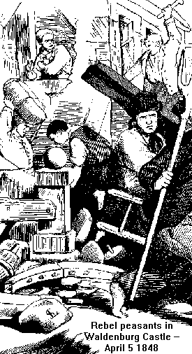

{.right}

The Peasant War in Germany by Frederick Engels

# Addendum to the Preface

THE preceding lines were written over four years ago, but they are valid
also at present. What was true after Sadowa and the partition of Germany
is being confirmed also after Sedan and the erection of the Holy German
Empire of Prussian nationality. Little indeed are the "world-shaking"
activities of the States in the realm of so-called big politics in a
position to change the trend of historic development.

What these grand activities of the States are in a position to
accomplish is to hasten the tempo of historic movement. In this respect,
the originators of the above-mentioned "world-shaking" events have made
involuntary successes which to themselves appear highly undesirable, but
which, however, they must take into the bargain, for better or worse.

Already the war of 1866 had shaken the old Prussia to its foundations.
After 1848 it was difficult to bring the rebellious industrial element
of the western provinces, bourgeois as well as proletarian, under the
old discipline. Still, somehow, this was accomplished, and the interests
of the Junkers of the eastern provinces, together with those of the
army, again became dominant in the State. In 1866 almost all the
northwest of Germany became Prussian. Besides the incurable moral injury
to the Prussian crown, by the fact that it had swallowed up three other
crowns by the grace of God, the centre of gravity of the monarchy had
moved considerably westward. The four million Rhinelanders and
Westphalians were reinforced, first, by four million Germans annexed
through the North German Alliance directly, and then by six million
annexed indirectly. In 1870, however, eight million southwest Germans
were added, so that, in the "new monarchy," the fourteen and a half
million old Prussians (all the six East Elbian provinces, among them,
two million Poles) were opposed by twenty-five million who had long
outgrown the old Prussian junker feudalism. So it happened that the very
victories of the Prussian army displaced the entire foundation of the
Prussian State edifice; the junker dominance became ever more
intolerable, even for the government itself. At the same time, however,
the struggle between the bourgeoisie and the workers, made inevitable by
the impetuous growth of industry, relegated to the background the
struggle between Junkers and bourgeoisie, so that the inner social
foundations of the old State suffered a complete transformation. Ever
since 1840, the condition making possible the existence of the slowly
rotting monarchy was the struggle between nobility and bourgeoisie,
wherein the monarchy retained equilibrium. From the moment, however,
when it was no more a question of protecting the nobility against the
onslaught of the bourgeoisie, but of protecting all propertied classes
against the onslaught of the working-class, the absolute monarchy had to
turn to that form of state which was expressly devised for this specific
purpose -- the Bonapartist monarchy. This change of Prussia towards
Bonapartism I have discussed in another place (*Woknungsfrage*). What I
did not stress there, and what is very important in this connection, is
that this change was the greatest progress made by Prussia after 1848,
which only shows how backward Prussia was in point of modern
development. It is a fact that the Prussian State still was a
semi-feudal State, whereas Bonapartism is, at all events, a modern form
of state which presupposes the abolition of feudalism. Thus Prussia must
decide to do away with its numerous remnants of feudalism, to sacrifice
its junkerdom as such. This, naturally, is being done in the mildest
possible form, and under the tune of the favourite melody, "Always
slowly forward." An example of such "reform" work is the notorious
organisation of districts, which, removing the feudal privileges of the
individual junker in relation to his estate, restores them as special
privileges of the big landowners in relation to the entire district. The
substance remains, it being only translated from the feudal into the
bourgeois dialect. The old Prussian junker is forcibly being transformed
into something akin to the English squire. He need not have offered so
much resistance, because the one is just as foolish as the other.

Thus it was the peculiar feat of Prussia not only to culminate, by the
end of this century, her bourgeois revolution begun in 1808--13 and
continued in 1848, but to culminate it in the present form of
Bonapartism. If everything goes well, and the world remains nice and
quiet, and we all become old enough, we can still perhaps live to see --
about 1900 -- the government of Prussia actually relinquishing all
feudal institutions, and Prussia finally reaching a point where France
stood in 1792.

Speaking positively, the abolition of feudalism means the introduction
of bourgeois conditions. In the measure as the privileges of the
nobility fall, legislation becomes more and more bourgeois. Here, again,
we meet with the chief point at issue, the attitude of the German
bourgeoisie towards the government. We have seen that the government is
compelled to introduce these slow and petty reforms, but in its relation
to the bourgeoisie, the government portrays these small concessions as
sacrifices in favour of the bourgeoisie, as concessions yielded by the
crown with difficulty and pain, and for which the bourgeoisie must, in
return, yield something to the government. The bourgeoisie, on the other
hand, though quite aware of this state of affairs, allows itself to be
fooled. This is the source of the tacit agreement which is the basis of
all Reichstag and Chamber debates. On the one hand, the government
reforms the laws at a snail pace tempo in the interests of the
bourgeoisie; it removes the impediments to industry emanating from the
multiplicity of small states; it creates unity of coinage, of measures
and weights; it gives freedom of trade, etc.; it grants the freedom of
movement; it puts the working power of Germany at the unlimited disposal
of capital; it creates favourable conditions for trade and speculation.
On the other hand, the bourgeoisie leaves in the hands of the government
all actual political power; it votes taxes, loans and recruits; it helps
to frame all new reform laws in a way that the old police power over
undesirable individuals shall remain in full force. The bourgeoisie buys
its gradual social emancipation for the price of immediate renunciation
of its own political power. Naturally, the motive which makes such
agreement acceptable to the bourgeoisie is not the fear of the
government but the fear of the proletariat.

Miserable as the bourgeoisie appears in the political realm, it cannot
be denied that as far as industry and commerce are concerned, the
bourgeoisie fulfils its historic duty. The growth of industry and
commerce mentioned already in the introduction to the second edition has
been going on with even greater vigour. What has taken place in the
Rhenish-Westphalian industrial region since 1869, is unprecedented for
Germany, and it reminds one of the rapid growth in the English
manufacturing districts at the beginning of this century. The same thing
will happen in Saxony and Upper Silesia, in Berlin, Hanover, and the
southern States. At last we have world trade, a really big industry, and
a really modern bourgeoisie. But we have also had a real crisis, and we
have a truly mighty proletariat. For the future historian of Germany,
the battle roar of 1859--64 on the field of Spicheren, Mars la Tour,
Sedan, and the rest, will be of much less importance than the
unpretentious, quiet, and constantly forward-moving development of the
German proletariat. Immediately after 1870, the German workers stood
before a grave trial -- the Bonapartist war provocation and its natural
sequence, the general national enthusiasm in Germany. The German workers
did not allow themselves to be illusioned for a moment. Not a trace of
national chauvinism made itself manifest among them. In the midst of a
mania for victory, they remained cool, demanding "equitable peace with
the French Republic and no annexations," and not even the state of siege
was in a position to silence them. No glory of battle, no phraseology of
German "imperial magnificence" attracted them. Their sole aim remained
the liberation of the entire European proletariat. We may say with full
assurance that in no country have the workers stood such a difficult
test with such splendid results.

The state of siege of wartime was followed by trials for treason, *lèse
majesté*, and contempt of officers and by ever increasing police
atrocities practised in peace time. *The Volksstaat* had three or four
editors in prison simultaneously; the other papers, in the same ratio.
Every known party speaker had to face court at least once a year, and
was usually convicted. Deportations, confiscations, suppressions of
meetings rapidly followed one another, but all to no avail. The place of
every prisoner or deportee was immediately filled by another. For one
suppressed gathering, two others were substituted, wearing out arbitrary
police power in one locality after the other by endurance and strict
conformity to the law. Persecution defeated its own purpose. Far from
breaking the workers' party or even bending it, it attracted ever new
recruits, and strengthened the organisation. In their struggle against
the authorities and the individual bourgeois, the workers manifested an
intellectual and moral superiority. Particularly in their conflicts with
the employers of labour did they show that they, the workers, were now
the educated class, while the capitalists were dupes. In their fights, a
sense of humour prevailed, showing how sure they were of their cause,
and how superior they felt. A struggle thus conducted on historically
prepared soil must yield great results. The success of the January
(1874) elections stood out, unique in the history of the modern labour
movement, and the astonishment aroused by them throughout Europe was
perfectly deserved.

The German workers have two important advantages compared with the rest
of Europe. First, they belong to the most theoretical people of Europe;
second, they have retained that sense of theory which the so-called
"educated" people of Germany have totally lost. Without German
philosophy, particularly that of Hegel, German scientific Socialism (the
only scientific Socialism extant) would never have come into existence.
Without a sense for theory, scientific Socialism would have never become
blood and tissue of the workers. What an enormous advantage this is, may
be seen on the one hand from the indifference of the English labour
movement towards all theory, which is one of the reasons why it moves so
slowly in spite of the splendid organisation of the individual unions;
on the other hand, from the mischief and confusion created by
Proudhonism in its original form among the Frenchmen and Belgians, and
in its caricature form, as presented by Bakunin, among the Spaniards and
Italians.

The second advantage is that, chronologically speaking, the Germans were
the last to appear in the labour movement. In the same manner as German
theoretical Socialism will never forget that it rests on the shoulders
of Saint Simon, Fourier and Owen, the three who, in spite of their
fantastic notions and Utopianism, belonged to the most significant heads
of all time and whose genius anticipated numerous things the correctness
of which can now be proved in a scientific way, so the practical German
labour movement must never forget that it has developed on the shoulders
of the English and French movements, that it had utilised their
experience, acquired at a heavy price, and that for this reason it was
in a position to avoid their mistakes which in their time were
unavoidable. Without the English trade unions and the French political
workers' struggles preceding the German labour movement, without the
mighty impulse given by the Paris Commune, where would we now be?

It must be said to the credit of the German workers that they have
utilised the advantages of their situation with rare understanding. For
the first time in the history of the labour movement the struggle is
being so conducted that its three sides, the theoretical, the political
and the practical economical (opposition to the capitalists), form one
harmonious and well-planned entity. In this concentric attack, as it
were, lies the strength and invincibility of the German movement.

It is due to this advantageous situation on the one hand, to the insular
peculiarities of the British, and to the cruel suppression of the French
movements on the other, that for the present moment the German workers
form the vanguard of the proletarian struggle. How long events will
allow them to occupy this post of honour cannot be foreseen. But as long
as they are placed in it, let us hope that they will discharge their
duties in the proper manner. It is the specific duty of the leaders to
gain an ever clearer understanding of the theoretical problems, to free
themselves more and more from the influence of traditional phrases
inherited from the old conception of the world, and constantly to keep
in mind that Socialism, having become a science, demands the same
treatment as every other science -- it must be studied. The task of the
leaders will be to bring understanding, thus acquired and clarified, to
the working masses, to spread it with increased enthusiasm, to close the
ranks of the party organisations and of the labour unions with ever
greater energy. The votes cast in favour of the Socialists last January
may represent considerable strength, but they still are far from being
the majority of the German working class; and encouraging as may be the
successes of the propaganda among the rural population, more remains to
be done in this field. The slogan is not to flinch in the struggle. The
task is to wrest from the enemy's hands one seat after the other, one
electoral district after the other. In the first place, however, it is
necessary to retain a real international spirit which permits of no
chauvinism, which joyfully greets each new step of the proletarian
movement, no matter in which nation it is made. If the German workers
proceed in this way, they may not march exactly at the head of the
movement -- it is not in the interest of the movement that the workers
of one country should march at the head of all -- but they will occupy
an honourable place on the battle line, and they will stand armed for
battle when other unexpected grave trials or momentous events will
demand heightened courage, heightened determination, and the will to
act.

+-----------------------------------+-----------------------------------+
|                                   | FREDERICK ENGELS\                 |
|                                   | *London, July 1, 1874.*           |
+-----------------------------------+-----------------------------------+

 

------------------------------------------------------------------------

[Contents](index.htm) \| [Chapter 1](ch01.htm) \| [Marx/Engels
Archive](../../../index.htm)

Last updated on 15 July 2020
