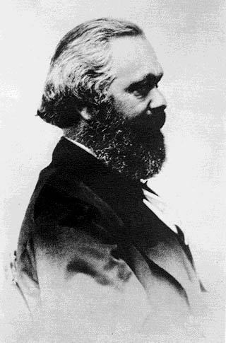

{width="200"
height="303" border="1" align="left" hspace="12"}

Speech by Marx to the\
First International Working Men\'s Association, June 1865

# Value, Price and Profit

------------------------------------------------------------------------

[Source]{.info}: Marx, Karl. *Value, Price and Profit*. New York:
International Co., Inc, 1969;\
[Written]{.info}: between end of May and June 27, 1865;\
[First published]{.info}: 1898;\
[ Edited]{.info}: by Eleanor Marx Aveling;\
[HTML Mark-up]{.info}: Mike Ballard, 1995;\
[Proofed]{.info}: and corrected by Brandon Poole, 2009.

[Introduction](introduction.htm)

------------------------------------------------------------------------

    [Preface](preface.htm) by Edward Aveling

    [Preliminary](ch01.htm#c0)\
 1. [Production and Wages](ch01.htm#c1)\
 2. [Production, Wages, Profits](ch01.htm#c2)\
 3. [Wages and Currency](ch01.htm#c3)\
 4. [Supply and Demand](ch01.htm#c4)\
 5. [Wages and Prices](ch01.htm#c5)\
 6. [Value and Labour](ch02.htm#c6)\
 7. [Labour Power](ch02.htm#c7)\
 8. [Production of Surplus Value](ch02.htm#c8)\
 9. [Value of Labour](ch02.htm#c9)\
10. [Profit is made by Selling a Commodity at its Value](ch02.htm#c10)\
11. [The different Parts into which Surplus Value is
Decomposed](ch02.htm#c11)\
12. [The General Relation of Profits, Wages, and Prices](ch03.htm#c12)\
13. [Main cases of Attempts at Raising Wages or Resisting their
Fall](ch03.htm#c13)\
14. [The Struggle between Capital and Labour, and its
Results](ch03.htm#c14)\

 

------------------------------------------------------------------------

[Study Guide](guide.htm) \| [Notes by Marx](notes.htm)\
[Marx and Engels on Political Economy](../../subject/economy/index.htm)
\| [Marx Engels Archive](../../../index.htm)
