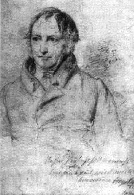

Frederick Engels\
Ludwig Feuerbach and the End of Classical German Philosophy

------------------------------------------------------------------------

### Part 1: Hegel

------------------------------------------------------------------------

 

{border="1" width="275" align="right" hspace="12"}

The volume before us ^[(1)](#1){#1b}^ carries us back to a period which,
although in time no more than a generation behind us, has become as
foreign to the present generation in Germany as if it were already a
hundred years old. Yet it was the period of Germany's preparation for
the Revolution of 1848; and all that has happened since then in our
country has been merely a continuation of 1848, merely the execution of
the last will and testament of the revolution.

[]{#001}Just as in France in the 18th century, so in Germany in the
19th, a philosophical revolution ushered in the political collapse. But
how different the two looked! The French were in open combat against all
official science, against the church and often also against the state;
their writings were printed across the frontier, in Holland or England,
while they themselves were often in jeopardy of imprisonment in the
Bastille. On the other hand, the Germans were professors,
state-appointed instructors of youth; their writings were recognized
textbooks, and the termination system of the whole development --- the
Hegelian system --- was even raised, as it were, to the rank of a royal
Prussian philosophy of state! Was it possible that a revolution could
hide behind these professors, behind their obscure, pedantic phrases,
their ponderous, wearisome sentences? Were not precisely these people
who were then regarded as the representatives of the revolution, the
liberals, the bitterest opponents of this brain-confusing philosophy?
But what neither the government nor the liberals saw was seen at least
by one man as early as 1833, and this man was indeed none other than
Heinrich Heine.^[\[A\]](#A){#Ab}^

[]{#002}Let us take an example. No philosophical proposition has earned
more gratitude from narrow-minded governments and wrath from equally
narrow-minded liberals than Hegel's famous statement: "All that is real
is rational; and all that is rational is real." That was tangibly a
sanctification of things that be, a philosophical benediction bestowed
upon despotism, police government, Star Chamber proceedings and
censorship. That is how Frederick William III and how his subjects
understood it. But according to Hegel certainly not everything that
exists is also real, without further qualification. For Hegel the
attribute of reality belongs only to that which at the same time is
necessary: "In the course of its development reality proves to be
necessity." A particular governmental measure --- Hegel himself cites
the example of "a certain tax regulation" --- is therefore for him by no
means real without qualification. That which is necessary, however,
proves itself in the last resort to be also rational; and, applied to
the Prussian state of that time, the Hegelian proposition, therefore,
merely means: this state is rational, corresponds to reason, insofar as
it is necessary; and if it nevertheless appears to us to be evil, but
still, in spite of its evil character, continues to exist, then the evil
character of the government is justified and explained by the
corresponding evil character of its subjects. The Prussians of that day
had the government that they deserved.

[]{#003}Now, according to Hegel, reality is, however, in no way an
attribute predictable of any given state of affairs, social or
political, in all circumstances and at all times. On the contrary. The
Roman Republic was real, but so was the Roman Empire, which superseded
it. In 1789, the French monarchy had become so unreal, that is to say,
so robbed of all necessity, so irrational, that it had to be destroyed
by the Great Revolution, of which Hegel always speaks with the greatest
enthusiasm. In this case, therefore, the monarchy was the unreal and the
revolution the real. And so, in the course of development, all that was
previously real becomes unreal, loses it necessity, its right of
existence, its rationality. And in the place of moribund reality comes a
new, viable reality --- peacefully if the old has enough intelligence to
go to its death without a struggle; forcibly if it resists this
necessity. Thus the Hegelian proposition turns into its opposite through
Hegelian dialectics itself: All that is real in the sphere of human
history, becomes irrational in the process of time, is therefore
irrational by its very destination, is tainted beforehand with
irrationality, and everything which is rational in the minds of men is
destined to become real, however much it may contradict existing
apparent reality. In accordance with all the rules of the Hegelian
method of thought, the proposition of the rationality of everything
which is real resolves itself into the other proposition: All that
exists deserves to perish.

[]{#004}But precisely therein lay the true significance and the
revolutionary character of the Hegelian philosophy (to which, as the
close of the whole movement since Kant, we must here confine ourselves),
that it once and for all dealt the death blow to the finality of all
product of human thought and action. Truth, the cognition of which is
the business of philosophy, was in the hands of Hegel no longer an
aggregate of finished dogmatic statements, which, once discovered, had
merely to be learned by heart. Truth lay now in the process of cognition
itself, in the long historical development of science, which mounts from
lower to ever higher levels of knowledge without ever reaching, by
discovering so-called absolute truth, a point at which it can proceed no
further, where it would have nothing more to do than to fold its hands
and gaze with wonder at the absolute truth to which it had attained. And
what holds good for the realm of philosophical knowledge holds good also
for that of every other kind of knowledge and also for practical action.
Just as knowledge is unable to reach a complete conclusion in a perfect,
ideal condition of humanity, so is history unable to do so; a perfect
society, a perfect "state", are things which can only exist in
imagination. On the contrary, all successive historical systems are only
transitory stages in the endless course of development of human society
from the lower to the higher. Each stage is necessary, and therefore
justified for the time and conditions to which it owes its origin. But
in the face of new, higher conditions which gradually develop in its own
womb, it loses vitality and justification. It must give way to a higher
stage which will also in its turn decay and perish. Just as the
bourgeoisie by large-scale industry, competition, and the world market
dissolves in practice all stable time-honored institutions, so this
dialectical philosophy dissolves all conceptions of final, absolute
truth and of absolute states of humanity corresponding to it. For it
\[dialectical philosophy\], nothing is final, absolute, sacred. It
reveals the transitory character of everything and in everything;
nothing can endure before it except the uninterrupted process of
becoming and of passing away, of endless ascendancy from the lower to
the higher. And dialectical philosophy itself is nothing more than the
mere reflection of this process in the thinking brain. It has, of
course, also a conservative side; it recognizes that definite stages of
knowledge and society are justified for their time and circumstances;
but only so far. The conservatism of this mode of outlook is relative;
its revolutionary character is absolute --- the only absolute
dialectical philosophy admits.

[]{#005}It is not necessary, here, to go into the question of whether
this mode of outlook is thoroughly in accord with the present state of
natural science, which predicts a possible end even for the Earth, and
for its habitability a fairly certain one; which therefore recognizes
that for the history of mankind, too, there is not only an ascending but
also a descending branch. At any rate, we still find ourselves a
considerable distance from the turning-point at which the historical
course of society becomes one of descent, and we cannot expect Hegelian
philosophy to be concerned with a subject which natural science, in its
time, had not at all placed upon the agenda as yet.

[]{#006}But what must, in fact, be said here is this: that in Hegel the
views developed above are not so sharply delineated. They are a
necessary conclusion from his method, but one which he himself never
drew with such explicitness. And this, indeed, for the simple reason
that he was compelled to make a system and, in accordance with
traditional requirements, a system of philosophy must conclude with some
sort of absolute truth. Therefore, however much Hegel, especially in his
*Logic*, emphasized that this eternal truth is nothing but the logical,
or, the historical, process itself, he nevertheless finds himself
compelled to supply this process with an end, just because he has to
bring his system to a termination at some point or other. In his
*Logic*, he can make this end a beginning again, since here the point of
the conclusion, the absolute idea --- which is only absolute insofar as
he has absolutely nothing to say about it --- "alienates", that is,
transforms, itself into nature and comes to itself again later in the
mind, that is, in thought and in history. But at the end of the whole
philosophy, a similar return to the beginning is possible only in one
way. Namely, by conceiving of the end of history as follows: mankind
arrives at the cognition of the self-same absolute idea, and declares
that this cognition of the absolute idea is reached in Hegelian
philosophy. In this way, however, the whole dogmatic content of the
Hegelian system is declared to be absolute truth, in contradiction to
his dialectical method, which dissolves all dogmatism. Thus the
revolutionary side is smothered beneath the overgrowth of the
conservative side. And what applies to philosophical cognition applies
also to historical practice. Mankind, which, in the person of Hegel, has
reached the point of working out the absolute idea, must also in
practice have gotten so far that it can carry out this absolute idea in
reality. Hence the practical political demands of the absolute idea on
contemporaries may not be stretched too far. And so we find at the
conclusion of the *Philosophy of Right* that the absolute idea is to be
realized in that monarchy based on social estates which Frederick
William III so persistently but vainly promised to his subjects, that
is, in a limited, moderate, indirect rule of the possessing classes
suited to the petty-bourgeois German conditions of that time; and,
moreover, the necessity of the nobility is demonstrated to us in a
speculative fashion.

[]{#007}The inner necessities of the system are, therefore, of
themselves sufficient to explain why a thoroughly revolutionary method
of thinking produced an extremely tame political conclusion. As a matter
of fact, the specific form of this conclusion springs from this, that
Hegel was a German, and like his contemporary Goethe had a bit of the
philistine's queue dangling behind. Each of them was an Olympian Zeus in
his own sphere, yet neither of them ever quite freed himself from German
philistinism.

[]{#008}But all this did not prevent the Hegelian system from covering
an incomparably greater domain than any earlier system, nor from
developing in this domain a wealth of thought, which is astounding even
today. The phenomenology of mind (which one may call a parallel of the
embryology and palaeontology of the mind, a development of individual
consciousness through its different stages, set in the form of an
abbreviated reproduction of the stages through which the consciousness
of man has passed in the course of history), logic, natural philosophy,
philosophy of mind, and the latter worked out in its separate,
historical subdivisions: philosophy of history, of right, of religion,
history of philosophy, aesthetics, etc. --- in all these different
historical fields Hegel labored to discover and demonstrate the
pervading thread of development. And as he was not only a creative
genius but also a man of encyclopaedic erudition, he played an
epoch-making role in every sphere. It is self-evident that owing to the
needs of the "system" he very often had to resort to those forced
constructions about which his pigmy opponents make such a terrible fuss
even today. But these constructions are only the frame and scaffolding
of his work. If one does not loiter here needlessly, but presses on
farther into the immense building, one finds innumerable treasures which
today still possess undiminshed value. With all philosophers it is
precisely the "system" which is perishable; and for the simple reason
that it springs from an imperishable desire of the human mind --- the
desire to overcome all contradictions. But if all contradictions are
once and for all disposed of, we shall have arrived at so-called
absolute truth --- world history will be at an end. And yet it has to
continue, although there is nothing left for it to do --- hence, a new,
insoluble contradiction. As soon as we have once realized --- and in the
long run no one has helped us to realize it more than Hegel himself ---
that the task of philosophy thus stated means nothing but the task that
a single philosopher should accomplish that which can only be
accomplished by the entire human race in its progressive development ---
as soon as we realize that, there is an end to all philosophy in the
hitherto accepted sense of the word. One leaves alone "absolute truth",
which is unattainable along this path or by any single individual;
instead, one pursues attainable relative truths along the path of the
positive sciences, and the summation of their results by means of
dialectical thinking. At any rate, with Hegel philosophy comes to an
end; on the one hand, because in his system he summed up its whole
development in the most splendid fashion; and on the other hand,
because, even though unconsciously, he showed us the way out of the
labyrinth of systems to real positive knowledge of the world.

[]{#009}One can imagine what a tremendous effect this Hegelian system
must have produced in the philosophy-tinged atmosphere of Germany. It
was a triumphant procession which lasted for decades and which by no
means came to a standstill on the death of Hegel. On the contrary, it
was precisely from 1830 to 1840 that "Hegelianism" reigned most
exclusively, and to a greater or lesser extent infected even its
opponents. It was precisely in this period that Hegelian views,
consciously or unconsciously, most extensively penetrated the most
diversified sciences and leavened even popular literature and the daily
press, from which the average "educated consciousness" derives its
mental pabulum. But this victory along the whole front was only the
prelude to an internal struggle.

[]{#010}As we have seen, the doctrine of Hegel, taken as a whole, left
plenty of room for giving shelter to the most diverse practical party
views. And in the theoretical Germany of that time, two things above all
were practical: religion and politics. Whoever placed the chief emphasis
on the Hegelian *system* could be fairly conservative in both spheres;
whoever regarded the dialectical *method* as the main thing could belong
to the most extreme opposition, both in politics and religion. Hegel
himself, despite the fairly frequent outbursts of revolutionary wrath in
his works, seemed on the whole to be more inclined to the conservative
side. Indeed, his system had cost him much more "hard mental plugging"
than his method. Towards the end of the thirties, the cleavage in the
school became more and more apparent. The Left wing, the so-called Young
Hegelians, in their fight with the pietist orthodox and the feudal
reactionaries, abandoned bit by bit that philosophical-genteel reserve
in regard to the burning questions of the day which up to that time had
secured state toleration and even protection for their teachings. And
when in 1840, orthodox pietism and absolutist feudal reaction ascended
the throne with Frederick William IV, open partisanship became
unavoidable. The fight was still carried on with philosophical weapons,
but no longer for abstract philosophical aims. It turned directly on the
destruction of traditional religion and of the existing state. And while
in the *Deutsche Jahrbucher* ^[\[B\]](#B){#Bb}^the practical ends were
still predominantly put forward in philosophical disguise, in the
*Rheinische Zeitung* of 1842 the Young Hegelian school revealed itself
directly as the philosophy of the aspiring radical bourgeoisie and used
the meagre cloak of philosophy only to deceive the censorship.

[]{#011}At that time, however, politics was a very thorny field, and
hence the main fight came to be directed against religion; this fight,
particularly since 1840, was indirectly also political. Strauss' *Life
of Jesus*, published in 1835, had provided the first impulse. The theory
therein developed of the formation of the gospel myths was combated
later by Bruno Bauer with proof that a whole series of evangelic stories
had been fabricated by the authors themselves. The controversy between
these two was carried out in the philosophical disguise of a battle
between "self-consciousness" and "substance". The question whether the
miracle stories of the gospels came into being through
unconscious-traditional myth-creation within the bosom of the community
or whether they were fabricated by the evangelists themselves was
magnified into the question whether, in world history, "substance" or
"self-consciousness" was the decisive operative force. Finally came
Stirner, the prophet of contemporary anarchism --- Bakunin has taken a
great deal from him --- and capped the sovereign "self-consciousness" by
his sovereign "ego"^[\[C\]](#C){#Cb}^.

[]{#012}We will not go further into this side of the decomposition
process of the Hegelian school. More important for us is the following:
the main body of the most determined Young Hegelians was, by the
practical necessities of its fight against positive religion, driven
back to Anglo-French materialism. This brought them into conflict with
the system of their school. While materialism conceives nature as the
sole reality, nature in the Hegelian system represents merely the
"alienation" of the absolute idea, so to say, a degradation of the idea.
At all events, thinking and its thought-product, the idea, is here the
primary, nature the derivative, which only exists at all by the
condescension of the idea. And in this contradiction they floundered as
well or as ill as they could.

[]{#013}Then came Feuerbach's *Essence of
Christianity*^[\[D\]](#D){#Db}^. With one blow, it pulverized the
contradiction, in that without circumlocutions it placed materialism on
the throne again. Nature exists independently of all philosophy. It is
the foundation upon which we human beings, ourselves products of nature,
have grown up. Nothing exists outside nature and man, and the higher
beings our religious fantasies have created are only the fantastic
reflection of our own essence. The spell was broken; the "system" was
exploded and cast aside, and the contradiction, shown to exist only in
our imagination, was dissolved. One must himself have experienced the
liberating effect of this book to get an idea of it. Enthusiasm was
general; we all became at once Feuerbachians. How enthusiastically Marx
greeted the new conception and how much --- in spite of all critical
reservations --- he was influenced by it, one may read in the *The Holy
Family*^[\[E\]](#E){#Eb}^.

[]{#014}Even the shortcomings of the book contributed to its immediate
effect. Its literary, sometimes even high-flown, style secured for it a
large public and was at any rate refreshing after long years of abstract
and abstruse Hegelianizing. The same is true of its extravagant
deification of love, which, coming after the now intolerable sovereign
rule of "pure reason", had its excuse, if not justification. But what we
must not forget is that it was precisely these two weaknesses of
Feuerbach that "true Socialism", which had been spreading like a plague
in educated Germany since 1844, took as its starting-point, putting
literary phrases in the place of scientific knowledge, the liberation of
mankind by means of "love" in place of the emancipation of the
proletariat through the economic transformation of production --- in
short, losing itself in the nauseous fine writing and ecstacies of love
typified by Herr Karl Grun.

[]{#015}Another thing we must not forget is this: the Hegelian school
disintegrated, but Hegelian philosophy was not overcome through
criticism; Strauss and Bauer each took one of its sides and set it
polemically against the other. Feuerbach smashed the system and simply
discarded it. But a philosophy is not disposed of by the mere assertion
that it is false. And so powerful a work as Hegelian philosophy, which
had exercised so enormous an influence on the intellectual development
of the nation, could not be disposed of by simply being ignored. It had
to be "sublated" in its own sense, that is, in the sense that while its
form had to be annihilatedhrough criticism, the new content which had
been won through it had to be saved. How this was brought about we shall
see below.

[]{#016}But in the meantime, the Revolution of 1848 thrust the whole of
philosophy aside as unceremoniously as Feuerbach had thrust aside Hegel.
And in the process, Feuerbach himself was also pushed into the
background.

 

[]{#017}Part 2: [Materialism](ch02.htm)

 

------------------------------------------------------------------------

### Notes

[[1.](#1b){#1}]{.term} *Ludwig Feuerbach*, by K.N. Starcke, Ph.D.,
Stuttgart, Ferd. Enke. 1885.

[[A.](#Ab){#A}]{.info} Engels had in mind Heine's remarks on the "German
philosophical revolution" contained in the latter's sketches *Zur
Geschichte der Religion und Philosophie in Deutschland* (On the History
of Religion and Philosophy in Germany), written in 1833.

[[B.](#Bb){#B}]{.info} The *Deutsche Jahrbücher fur Wissenschaft und
Kunst* (German Annuals of Science and Art): Organ of the Young Hegelians
edited by A. Ruge and T. Echtermeyer, and published in Leipzig from 1841
to 1843.

[[C.](#Cb){#C}]{.info} Engels refers to Max Stirner's (pseudonym for
Kaspar Schmidt) *Der Einzige und sein Eigentum* (The Ego and His Own),
which appeared in 1845.

[[D.](#Db){#D}]{.info} Feuerbach's *Das Wesen des Christentums* ([The
Essence of
Christianity](../../../../../reference/archive/feuerbach/works/essence/index.htm))
appeared in Leipzig in 1841.

[[E.](#Eb){#E}]{.info} The full title of this book by Marx and Engels
is: *Die Heilige Familie oder Kritik der kritischen Kritik. Gegen Bruno
Bauer und Konsorten* ([The Holy Family, or a Criticism of Critical
Criticism. Against Bruno Bauer and
Co.](../../1845/holy-family/index.htm)). It was originally published in
Frankfort on the Main in 1845.

------------------------------------------------------------------------

[]{#018}Table of Contents: [Ludwig Feuerbach and the End of Classical
German Philosophy](index.htm)
