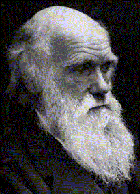

Frederick Engels\
Ludwig Feuerbach and the End of Classical German Philosophy

------------------------------------------------------------------------

### Part 2: Materialism

------------------------------------------------------------------------

 

{border="1" width="275" align="right" hspace="12"}

The great basic question of all philosophy, especially of more recent
philosophy, is that concerning the relation of thinking and being. From
the very early times when men, still completely ignorant of the
structure of their own bodies, under the stimulus of dream apparitions
^[(1)](#1){#1b}^ came to believe that their thinking and sensation were
not activities of their bodies, but of a distinct soul which inhabits
the body and leaves it at death --- from this time men have been driven
to reflect about the relation between this soul and the outside world.
If, upon death, it took leave of the body and lived on, there was no
occassion to invent yet another distinct death for it. Thus arose the
idea of immortality, which at that stage of development appeared not at
all as a consolation but as a fate against which it was no use fighting,
and often enough, as among the Greeks, as a positive misfortune. The
quandry arising from the common universal ignorance of what to do with
this soul, once its existence had been accepted, after the death of the
body, and not religious desire for consolation, led in a general way to
the tedious notion of personal immortality. In an exactly similar
manner, the first gods arose through the personification of natural
forces. And these gods in the further development of religions assumed
more and more extramundane form, until finally by a process of
abstraction, I might almost say of distillation, occurring naturally in
the course of man's intellectual development, out of the many more or
less limited and mutually limiting gods there arose in the minds of men
the idea of the one exclusive God of the monotheistic religions.

[]{#001}Thus the question of the relation of thinking to being, the
relation of the spirit to nature --- the paramount question of the whole
of philosophy --- has, no less than all religion, its roots in the
narrow-minded and ignorant notions of savagery. But this question could
for the first time be put forward in its whole acuteness, could achieve
its full significance, only after humanity in Europe had awakened from
the long hibernation of the Christian Middle Ages. The question of the
position of thinking in relation to being, a question which, by the way,
had played a great part also in the scholasticism of the Middle Ages,
the question: which is primary, spirit or nature --- that question, in
relation to the church, was sharpened into this: Did God create the
world or has the world been in existence eternally?

[]{#002}The answers which the philosophers gave to this question split
them into two great camps. Those who asserted the primacy of spirit to
nature and, therefore, in the last instance, assumed world creation in
some form or other --- and among the philosophers, Hegel, for example,
this creation often becomes still more intricate and impossible than in
Christianity --- comprised the camp of idealism. The others, who
regarded nature as primary, belong to the various schools of
materialism.

[]{#003}These two expressions, idealism and materialism, originally
signify nothing else but this; and here too they are not used in any
other sense. What confusion arises when some other meaning is put to
them will be seen below.

[]{#004}But the question of the relation of thinking and being had yet
another side: in what relation do our thoughts about the world
surrounding us stand to this world itself? Is our thinking capable of
the cognition of the real world? Are we able in our ideas and notions of
the real world to produce a correct reflection of reality? In
philosophical language this question is called the question of identity
of thinking and being, and the overwhelming majority of philosophers
give an affirmative answer to this question. With Hegel, for example,
its affirmation is self-evident; for what we cognize in the real world
is precisely its thought-content --- that which makes the world a
gradual realization of the absolute idea, which absolute idea has
existed somewhere from eternity, independent of the world and before the
world. But it is manifest without further proof that thought can know a
content which is from the outset a thought-content. It is equally
manifest that what is to be proved here is already tacitly contained in
the premises. But that in no way prevents Hegel from drawing the further
conclusion from his proof of the identity of thinking and being that his
philosophy, because it is correct for his thinking, is therefore the
only correct one, and that the identity of thinking and being must prove
its validity by mankind immediately translating his philosophy from
theory into practice and transforming the whole world according to
Hegelian principles. This is an illusion which he shares with well-nigh
all philosophers.

[]{#005}In addition, there is yet a set of different philosophers ---
those who question the possibility of any cognition, or at least of an
exhaustive cognition, of the world. To them, among the more modern ones,
belong Hume and Kant, and they played a very important role in
philosophical development. What is decisive in the refutation of this
view has already been said by Hegel, in so far as this was possible from
an idealist standpoint. The materialistic additions made by Feuerbach
are more ingenious than profound. The most telling refutation of this as
of all other philosophical crotchets is practice --- namely, experiment
and industry. If we are able to prove the correctness of our conception
of a natural process by making it ourselves, bringing it into being out
of its conditions and making it serve our own purposes into the bargain,
then there is an end to the Kantian ungraspable "thing-in-itself". The
chemical substances produced in the bodies of plants and animals
remained just such "things-in-themselves" until organic chemistry began
to produce them one after another, whereupon the "thing-in-itself"
became a thing for us --- as, for instance, alizarin, the coloring
matter of the madder, which we no longer trouble to grow in the madder
roots in the field, but produce much more cheaply and simply from coal
tar. For 300 years, the Copernican solar system was a hypothesis with
100, 1,000, 10,000 to 1 chances in its favor, but still always a
hypothesis. But then Leverrier, by means of the data provided by this
system, not only deduced the necessity of the existence of an unknown
planet, but also calculated the position in the heavens which this
planet must necessarily occupy, and when \[Johann\] Galle really found
this planet \[Neptune, discovered 1846, at Berlin Observatory\], the
Copernican system was proved. If, nevertheless, the neo-Kantians are
attempting to resurrect the Kantian conception in Germany, and the
agnostics that of Hume in England (where in fact it never became
extinct), this is, in view of their theoretical and practical refutation
accomplished long ago, scientifically a regression and practically
merely a shamefaced way of surreptitiously accepting materialism, while
denying it before the world.

[]{#006}But during this long period from Descartes to Hegel and from
Hobbes to Feuerbach, these philosophers were by no means impelled, as
they thought they were, solely by the force of pure reason. On the
contrary, what really pushed them forward most was the powerful and ever
more rapidly onrushing progress of natural science and industry. Among
the materialists this was plain on the surface, but the idealist systems
also filled themselves more and more with a materialist content and
attempted pantheistically to reconcile the antithesis between mind and
matter. Thus, ultimately, the Hegelian system represents merely a
materialism idealistically turned upside down in method and content.

[]{#007}It is, therefore, comprehensible that Starcke in his
characterization of Feuerbach first of all investigates the latter's
position in regard to this fundamental question of the relation of
thinking and being. After a short introduction, in which the views of
the preceding philosophers, particularly since Kant, are described in
unnecessarily ponderous philosophical language, and in which Hegel, by
an all too formalistic adherence to certain passages of his works, gets
far less his due, there follows a detailed description of the course of
development of Feuerbach's "metaphysics" itself, as this course was
successively reflected in those writings of this philosopher which have
a bearing here. This description is industriously and lucidly
elaborated; only, like the whole book, it is loaded with a ballast of
philosophical phraseology by no means everywhere unavoidable, which is
the more disturbing in its effect the less the author keeps to the
manner of expression of one and the same school, or even of Feuerbach
himself, and the more he interjects expressions of very different
tendencies, especially of the tendencies now rampant and calling
themselves philosophical.

[]{#008}The course of evolution of Feuerbach is that of a Hegelian --- a
never quite orthodox Hegelian, it is true --- into a materialist; an
evolution which at a definite stage necessitates a complete rupture with
the idealist system of his predecessor. With irresistible force,
Feuerbach is finally driven to the realization that the Hegelian
premundane existence of the "absolute idea", the "pre-existence of the
logical categories" before the world existed, is nothing more than the
fantastic survival of the belief in the existence of an extra-mundane
creator; that the material, sensuously perceptible world to which we
ourselves belong is the only reality; and that our consciousness and
thinking, however supra-sensuous they may seem, are the product of a
material, bodily organ, the brain. Matter is not a product of mind, but
mind itself is merely the highest product of matter. This is, of course,
pure materialism. But, having got so far, Feuerbach stops short. He
cannot overcome the customary philosophical prejudice, prejudice not
against the thing but against the name materialism. He says:

[]{#009}"To me materialism is the foundation of the edifice of human
essence and knowledge; but to me it is not what it is to the
physiologist, to the natural scientists in the narrower sense, for
example, to Moleschott, and necessarily is from their standpoint and
profession, namely, the edifice itself. Backwards I fully agree with the
materialists; but not forwards."

[]{#010}Here, Feuerbach lumps together the materialism that is a general
world outlook resting upon a definite conception of the relation between
matter and mind, and the special form in which this world outlook was
expressed at a definite historical stage --- namely, in the 18th
century. More than that, he lumps it with the shallow, vulgarized form
in which the materialism of the 18th century continues to exist today in
the heads of naturalists and physicians, the form which was preached on
their tours in the fifties by Buchner, Vogt, and Moleschott. But just as
idealism underwent a series of stages of development, so also did
materialism. With each epoch-making discovery even in the sphere of
natural science, it has to change its form; and after history was also
subjected to materialistic treatment, a new avenue of development has
opened here, too.

[]{#011}The materialism of the last century was predominantly
mechanical, because at that time, of all natural sciences, only
mechanics, and indeed only the mechanics of solid bodies --- celestial
and terrestrial --- in short, the mechanics of gravity, had come to any
definite close. Chemistry at that time existed only in its infantile,
phlogistic form ^[\[A\]](#A){#Ab}^. Biology still lay in swaddling
clothes; vegetable and animal organisms had been only roughly examined
and were explained by purely mechanical causes. What the animal was to
Descartes, man was to the materialists of the 18th century --- a
machine. This exclusive application of the standards of mechanics to
processes of a chemical and organic nature --- in which processes the
laws of mechanics are, indeed, also valid, but are pushed into the
backgrounds by other, higher laws --- constitutes the first specific but
at that time inevitable limitations of classical French materialism.

[]{#012}The second specific limitation of this materialism lay in its
inability to comprehend the universe as a process, as matter undergoing
uninterrupted historical development. This was in accordance with the
level of the natural science of that time, and with the metaphysical,
that is, anti-dialectical manner of philosophizing connected with it.
Nature, so much was known, was in eternal motion. But according to the
ideas of that time, this motion turned, also eternally, in a circle and
therefore never moved from the spot; it produced the same results over
and over again. This conception was at that time inevitable. The Kantian
theory of the origin of the Solar System \[that the Sun and planets
originated from incandescent rotating nebulous masses\] had been put
forward but recently and was still regarded merely as a curiosity. The
history of the development of the Earth, geology, was still totally
unknown, and the conception that the animate natural beings of today are
the result of a long sequence of development from the simple to the
complex could not at that time scientifically be put forward at all. The
unhistorical view of nature was therefore inevitable. We have the less
reason to reproach the philosophers of the 18th century on this account
since the same thing is found in Hegel. According to him, nature, as a
mere "alienation" of the idea, is incapable of development in time ---
capable only of extending its manifoldness in space, so that it displays
simultaneously and alongside of one another all the stages of
development comprised in it, and is condemned to an eternal repetition
of the same processes. This absurdity of a development in space, but
outside of time --- the fundamental condition of all development ---
Hegel imposes upon nature just at the very time when geology,
embryology, the physiology of plants and animals, and organic chemistry
were being built up, and when everywhere on the basis of these new
sciences brilliant foreshadowings of the later theory of evolution were
appearing (for instance, Goethe and Lamarck). But the system demanded
it; hence the method, for the sake of the system, had to become untrue
to itself.

[]{#013}This same unhistorical conception prevailed also in the domain
of history. Here the struggle against the remnants of the Middle Ages
blurred the view. The Middle Ages were regarded as a mere interruption
of history by a thousand years of universal barbarism. The great
progress made in the Middle Ages --- the extension of the area of
European culture, the viable great nations taking form there next to
each other, and finally the enormous technical progress of the 14th and
15th centuries --- all this was not seen. Thus a rational insight into
the great historical interconnectedness was made impossible, and history
served at best as a collection of examples and illustrations for the use
of philosophers.

[]{#014}The vulgarizing pedlars, who in Germany in the fifties dabbled
in materialism, by no means overcame this limitation of their teachers.
All the advances of natural science which had been made in the meantime
served them only as new proofs against the existence of a creator of the
world; and, indeed, they did not in the least make it their business to
develop the theory any further. Though idealism was at the end of its
tether and was dealt a death-blow by the Revolution of 1848, it had the
satisfaction of seeing that materialism had for the moment fallen lower
still. Feuerbach was unquestionably right when he refused to take
responsibility for this materialism; only he should not have confounded
the doctrines of these itinerant preachers with materialism in general.

[]{#015}Here, however, there are two things to be pointed out. First,
even during Feuerbach's lifetime, natural science was still in that
process of violent fermentation which only during the last 15 years had
reached a clarifying, relative conclusion. New scientific data were
acquired to a hitherto unheard-of extent, but the establishing of
interrelations, and thereby the bringing of order into this chaos of
discoveries following closely upon each other's heels, has only quite
recently become possible. It is true that Feuerbach had lived to see all
three of the decisive discoveries --- that of the cell, the
transformation of energy, and the theory of evolution named after
Darwin. But how could the lonely philosopher, living in rural solitude,
be able sufficiently to follow scientific developments in order to
appreciate at their full value discoveries which natural scientists
themselves at that time either still contested or did not know how to
make adequate use of? The blame for this falls solely upon the wretched
conditions in Germany, in consequence of which cobweb-spinning eclectic
flea-crackers had taken possession of the chairs of philosophy, while
Feuerbach, who towered above them all, had to rusticate and grow sour in
a little village. It is therefore not Feuerbach's fault that this
historical conception of nature, which had now become possible and which
removed all the one-sidedness of French materialism, remained
inaccessible to him.

[]{#016}Secondly, Feuerbach is quite correct in asserting that
exclusively natural-scientific materialism is indeed "the foundation of
the edifice of human knowledge, but not the edifice itself". For we live
not only in nature but also in human society, and this also no less than
nature has its history of development and its science. It was therefore
a question of bringing the science of society, that is, the sum total of
the so-called historical and philosophical sciences, into harmony with
the materialist foundation, and of reconstructing it thereupon. But it
did not fall to Feuerbach's lot to do this. In spite of the
"foundation", he remained here bound by the traditional idealist
fetters, a fact which he recognizes in these words: "Backwards I agree
with the materialists, but not forwards!"

[]{#017}But it was Feuerbach himself who did not go "forwards" here; in
the social domain, who did not get beyond his standpoint of 1840 or
1844. And this was again chiefly due to this reclusion which compelled
him, who, of all philosophers, was the most inclined to social
intercourse, to produce thoughts out of his solitary head instead of in
amicable and hostile encounters with other men of his calibre. Later, we
shall see in detail how much he remained an idealist in this sphere.

[]{#018}It need only be added here that Starcke looks for Feuerbach's
idealism in the wrong place.

[]{#019}"Feuerbach is an idealist; he believes in the progress of
mankind." []{#020}(p.19)

[]{#021}"The foundation, the substructure of the whole, remains
nevertheless idealism. Realism for us is nothing more than a protection
again aberrations, while we follow our ideal trends. Are not compassion,
love, and enthusiasm for truth and justice ideal forces?"
[]{#022}(p.VIII)

[]{#023}In the first place, idealism here means nothing, but the pursuit
of ideal aims. But these necessarily have to do at the most with Kantian
idealism and its "categorical imperative"; however, Kant himself called
his philosophy "transcendental idealism" by no means because he dealt
therein also with ethical ideals, but for quite other reasons, as
Starcke will remember. The superstitition that philosophical idealism is
pivoted round a belief in ethical, that is, social, ideals, arose
outside philosophy, among the German philistines, who learned by heart
from Schiller's poems the few morsels of philosophical culture they
needed. No one has criticized more severely the impotent "categorical
imperative" of Kant --- impotent because it demands the impossible, and
therefore never attains to any reality --- no one has more cruelly
derided the philistine sentimental enthusiasm for unrealizable ideals
purveyed by Schiller than precisely the complete idealist Hegel (see,
for example, his *Phenomenology*).

[]{#024}In the second place, we simply cannot get away from the fact
that everything that sets men acting must find its way through their
brains --- even eating and drinking, which begins as a consequence of
the sensation of hunger or thirst transmitted through the brain, and
ends as a result of the sensation of satisfaction likewise transmitted
through the brain. The influences of the external world upon man express
themselves in his brain, are reflected therein as feelings, impulses,
volitions --- in short, as "ideal tendencies", and in this form become
"ideal powers". If, then, a man is to be deemed an idealist because he
follows "ideal tendencies" and admits that "ideal powers" have an
influence over him, then every person who is at all normally developed
is a born idealist and how, in that case, can there still be any
materialists?

[]{#025}In the third place, the conviction that humanity, at least at
the present moment, moves on the whole in a progressive direction has
absolutely nothing to do with the antagonism between materialism and
idealism. The French materialists no less than the deists Voltaire and
Rousseau held this conviction to an almost fanatical degree, and often
enough made the greatest personal sacrifices for it. If ever anybody
dedicated his whole life to the "enthusiasm for truth and justice" ---
using this phrase in the good sense --- it was Diderot, for instance.
If, therefore, Starcke declares all this to be idealism, this merely
proves that the word materialism, and the whole antagonism between the
two trends, has lost all meaning for him here.

[]{#026}The fact is that Starcke, although perhaps unconsciously, in
this makes an unpardonable concession to the traditional philistine
prejudice against the word materialism resulting from its long-continued
defamation by the priests. By the word materialism, the philistine
understands gluttony, drunkenness, lust of the eye, lust of the flesh,
arrogance, cupidity, avarice, covetousness, profit-hunting, and
stock-exchange swindling --- in short, all the filthy vices in which he
himself indulges in private. By the word idealism he understands the
belief in virtue, universal philanthropy, and in a general way a "better
world", of which he boasts before others but in which he himself at the
utmost believes only so long as he is having the blues or is going
through the bankruptcy consequent upon his customary "materialist"
excesses. It is then that he sings his favorite song, What is man? ---
Half beast, half angel.

[]{#027}For the rest, Starcke takes great pains to defend Feuerbach
against the attacks and doctrines of the vociferous assistant professors
who today go by the name of philosophers in Germany. For people who are
interested in this afterbirth of classical German philosophy this is, of
course, a matter of importance; for Starcke himself it may have appeared
necessary. We, however, will spare the reader this.

 

[]{#028}Part 3: [Feuerbach](ch03.htm)

 

------------------------------------------------------------------------

 

^[(1)](#1b){#1}^ Among savages and lower barbarians the idea is still
universal that the human forms which appear in dreams are souls which
have temporarily left their bodies; the real man is, therefore, held
responsible for acts committed by his dream apparition against the
dreamer. Thus Imthurn found this belief current, for example, among the
Indians of Guiana in 1884.

^[\[A\]](#Ab){#A}^ Phlogistic Theory: The theory prevailing in chemistry
during the 17th and 18th centuries that combustion takes place due to
the presence in certain bodies of a special substance named phlogiston.

------------------------------------------------------------------------

[]{#029}Table of Contents: [Ludwig Feuerbach and the End of Classical
German Philosophy](index.htm)
