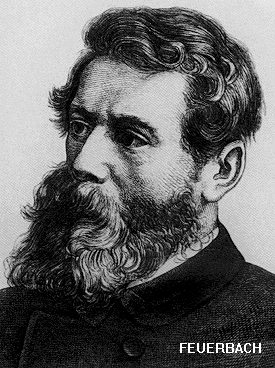

Frederick Engels\
Ludwig Feuerbach and the End of Classical German Philosophy

------------------------------------------------------------------------

### Part 3: Feuerbach

------------------------------------------------------------------------

 

{border="1" width="275" align="right" hspace="12"}

The real idealism of Feuerbach becomes evident as soon as we come to his
philosophy of religion and ethics. He by no means wishes to abolish
religion; he wants to perfect it. Philosophy itself must be absorbed in
religion.

[]{#001}"The periods of humanity are distinguished only by religious
changes. A historical movement is fundamental only when it is rooted in
the hearts of men. The heart is not a form of religion, so that the
latter should exist *also* in the heart; the heart is the essence of
religion." []{#002}(Quoted by Starcke, p.168.)

[]{#003}According to Feuerbach, religion is the relation between human
beings based on the affections, the relation based on the heart, which
relation until now has sought its truth in a fantastic mirror image of
reality --- in the mediation of one or many gods, the fantastic mirror
images of human qualities --- but now finds it directly and without any
mediation in the love between "I" and "Thou". Thus, finally, with
Feuerbach sex love becomes one of the highest forms, if not the highest
form, of the practice of his new religion.

[]{#004}Now relations between human beings, based on affection, and
especially between the two sexes, have existed as long as mankind has.
Sex love in particular has undergone a development and won a place
during the last 800 years which has made it a compulsory pivotal point
of all poetry during this period. The existing positive religions have
limited themselves to the bestowal of a higher consecration upon
state-regulated sex love --- that is, upon the marriage laws --- and
they could all disappear tomorrow without changing in the slightest the
practice of love and friendship. Thus the Christian religion in France,
as a matter of fact, so completely disappeared in the year 1793--95 that
even Napoleon could not re-introduce it without opposition and
difficulty; and this without any need for a substitute in Feuerbach's
sense, making itself in the interval.

[]{#005}Feuerbach's idealism consists here in this: he does not simply
accept mutual relations based on reciprocal inclination between human
beings, such as sex love, friendship, compassion, self-sacrifice, etc.,
as what they are in themselves --- without associating them with any
particular religion which to him, too, belongs to the past; but instead
he asserts that they will attain their full value only when consecrated
by the name of religion. The chief thing for him is not that these
purely human relations exist, but that they shall be conceived of as the
new, true, religion. They are to have full value only after they have
been marked with a religious stamp. Religion is derived from *religare*
\["to bind"\] and meant, originally, a bond. Therefore, every bond
between two people is a religion. Such etymological tricks are the last
resort of idealist philosophy. Not what the word means according to the
historical development of its actual use, but what it ought to mean
according to its derivation is what counts. And so sex love, and the
intercourse between the sexes, is apotheosized to a *religion*, merely
in order that the word religion, which is so dear to idealistic
memories, may not disappear from the language. The Parisian reformers of
the Louis Blanc trend used to speak in precisely the same way in the
forties. They, likewise, could conceive of a man without religion only
as a monster, and used to say to us: "Donc, l'atheisme c'est votre
religion!" \["Well, then atheism is your religion!"\] If Feuerbach
wishes to establish a true religion upon the basis of an essentially
materialist conception of nature, that is the same as regarding modern
chemistry as true alchemy. If religion can exist without its god,
alchemy can exist without its philosopher's stone. By the way, there
exists a very close connection between alchemy and religion. The
philosopher's stone has many godlike properties and the Egyptian-Greek
alchemists of the first two centuries of our era had a hand in the
development of Christian doctrines, as the data given by Kopp and
Bertholet have proved.

[]{#006}Feuerbach's assertion that "the periods of humanity are
distinguished only by religious changes" is decidedly false. Great
historical turning-points have been *accompanied* by religious changes
only so far as the three world religions which have existed up to the
present --- Buddhism, Christianity, and Islam --- are concerned. The old
tribal and national religions, which arose spontaneously, did not
proselytize and lost all their power of resistance as soon as the
independence of the tribe or people was lost. For the Germans, it was
sufficient to have simple contact with the decaying Roman world empire
and with its newly adopted Christian world religion which fitted its
economic, political, and ideological conditions. Only with these world
religions, arisen more or less artificially, particularly Christianity
and Islam, do we find that the more general historical movements acquire
a religious imprint. Even in regard to Christianity, the religious stamp
in revolutions of really universal significance is restricted to the
first stages of the bourgeoisie's struggle for emancipation --- from the
13th to the 17th century --- and is to be accounted for, not as
Feuerbach thinks by the hearts of men and their religious needs, but by
the entire previous history of the Middle Ages, which knew no other form
of ideology than religion and theology. But when the bourgeoisie of the
18th century was strengthened enough likewise to posses an ideology of
its own, suited to its own class standpoint, it made its great and
conclusive revolution --- the French ---, appealing exclusively to
juristic and political ideas, and troubling itself with religion only in
so far as it stood in its way. But it never occurred to it to put a new
religion in place of the old. Everyone knows how Robespierre failed in
his attempt \[to set up a religion of the "highest being"\].

[]{#007}The possibility of purely human sentiments in our intercourse
with other human beings has nowadays been sufficiently curtailed by the
society in which we must live, which is based upon class antagonism and
class rule. We have no reason to curtail it still more by exalting these
sentiments to a religion. And similarly the understanding of the great
historical class struggles has already been sufficiently obscured by
current historiography, particularly in Germany, so that there is also
no need for us to make such an understanding totally impossible by
transforming the history of these struggles into a mere appendix of
ecclesiastical history. Already here it becomes evident how far today we
have moved beyond Feuerbach. His "finest" passages in glorification of
his new religion of love are totally unreadable today.

[]{#008}The only religion which Feuerbach examines seriously is
Christianity, the world religion of the Occident, based upon monotheism.
He proves that the Christian god is only a fantastic reflection, a
mirror image, of man. Now, this god is, however, himself the product of
a tedious process of abstraction, the concentrated quintessence of the
numerous earlier tribal and national gods. And man, whose image this god
is, is therefore also not a real man, but likewise the quintessence of
the numerous real men, man in the abstract, therefore himself again a
mental image. Feuerbach, who on every page preaches sensuousness,
absorption in the concrete, in actuality, becomes thoroughly abstract as
soon as he begins to talk of any other than mere sex relations between
human beings.

[]{#009}Of these relations, only one aspect appeals to him: morality.
And here we are again struck by Feuerbach's astonishing poverty when
compared to Hegel. The latter's ethics, or doctrine of moral conduct, is
the philosophy of right, and embraces: (1) abstract right; (2) morality;
(3) social ethics \[Sittlichkeit\], under which are comprised: the
family, civil society, and the state.

[]{#010}Here the content is as realistic as the form is idealistic.
Besides morality, the whole sphere of law, economy, politics is here
included. With Feuerbach, it is just the reverse. In the form he is
realistic since he takes his start from man; but there is absolutely no
mention of the world in which this man lives; hence, this man remains
always the same abstract man who occupied the field in the philosophy of
religion. For this man is not born of woman; he issues, as from a
chrysalis, from the god of monotheistic religions. He therefore does not
live in a real world historically come into being and historically
determined. True, he has intercourse with other men; however, each one
of them is just as much an abstraction as he himself. In his philosophy
of religion we still had men and women, but in his ethics even this last
distinction disappears. Feuerbach, to be sure, at long intervals makes
such statements as: "Man thinks differently in a palace and in a hut."
"If because of hunger, of misery, you have no stuff in your body, you
likewise have no stuff for morality in your head, in your mind, or
heart." "Politics must become our religion," etc.

[]{#011}But Feuerbach is absolutely incapable of achieving anything with
these maxims. They remain mere phrases, and even Starcke has to admit
that for Feuerbach politics constituted an impassable frontier and the
"science of society, sociology, was *terra incognita* to him".

[]{#012}He appears just as shallow, in comparison with Hegel, in his
treatment of the antithesis of good and evil.

[]{#013}"One believes one is saying something great," Hegel remarks, "if
one says that 'man is naturally good'. But one forgets that one says
something far greater when one says 'man is naturally evil'."

[]{#014}With Hegel, evil is the form in which the motive force of
historical development presents itself. This contains the twofold
meaning that, on the one hand, each new advance necessarily appears as a
sacrilege against things hallowed, as a rebellion against condition,
though old and moribund, yet sanctified by custom; and that, on the
other hand, it is precisely the wicked passions of man --- greed and
lust for power --- which, since the emergence of class antagonisms,
serve as levers of historical development --- a fact of which the
history of feudalism and of the bourgeoisie, for example, constitutes a
single continual proof. But it does not occur to Feuerbach to
investigate the historical role of moral evil. To him, history is
altogether an uncanny domain in which he feels ill at ease. Even his
dictum: "Man as he sprang originally from nature was only a mere
creature of nature, not a man. Man is a product of man, of culture, of
history" --- with him, even this dictum remains absolutely sterile.

[]{#015}What Feuerbach has to tell us about morals can, therefore, only
be extremely meagre. The urge towards happiness is innate in man, and
must therefore form the basis of all morality. But the urge towards
happiness is subject to a double correction. First, by the natural
consequences of our actions: after the debauch comes the "blues", and
habitual excess is followed by illness. Secondly, by its social
consequences: if we do not respect the similar urge of other people
towards happiness they will defend themselves, and so interfere with our
own urge toward happiness. Consequently, in order to satisfy our urge,
we must be in a position to appreciate rightly the results of our
conduct and must likewise allow others an equal right to seek happiness.
Rational self-restraint with regard to ourselves, and love --- again and
again love! --- in our intercourse with others --- these are the basic
laws of Feuerbach's morality; from them, all others are derived. And
neither the most spirited utterances of Feuerbach nor the strongest
eulogies of Starcke can hide the tenuity and banality of these few
propositions.

[]{#016}Only very exceptionally, and by no means to this and other
people's profit, can an individual satisfy his urge towards happiness by
preoccupation with himself. Rather, it requires preoccupation with the
outside world, with means to satisfy his needs --- that is to say, food,
an individual of the opposite sex, books, conversation, argument,
activities, objects for use and working up. Feuerbach's morality either
presupposes that these means and objects of satisfaction are given to
every individual as a matter of course, or else it offers only
inapplicable good advice and is, therefore, not worth a brass farthing
to people who are without these means. And Feuerbach himself states this
in plain terms:

[]{#017}"Man thinks differently in a palace and in a hut. If because of
hunger, of misery, you have no stuff in your body, you likewise have no
stuff for morality in your head, in your mind, or heart."

[]{#018}Do matters fare any better in regard to the equal right of
others to satisfy their urge towards happiness? Feuerbach posed this
claim as absolute, as holding good for all times and circumstances. But
since when has it been valid? Was there ever in antiquity between slaves
and masters, or in the Middle Ages between serfs and barons, any talk
about an equal right to the urge towards happiness? Was not the urge
towards happiness of the oppressed class sacrificed ruthlessly and "by
the right of law" to that of the ruling class? Yes, that was indeed
immoral; nowadays, however, equality of rights is recognized. Recognized
in words ever since and inasmuch as the bourgeoisie, in its fight
against feudalism and in the development of capitalist production, was
compelled to abolish all privileges of estate, that is, personal
privileges, and to introduce the equality of all individuals before law,
first in the sphere in private law, then gradually also in the sphere of
public law. But the urge towards happiness thrives only to a trivial
extent on ideal rights. To the greatest extent of all it thrives on
material means; and capitalist production takes care to ensure that the
great majority of those equal rights shall get only what is essential
for bare existence. Capitalist production has, therefore, little more
respect, if indeed any more, for the equal right to the urge towards
happiness of the majority than had slavery or serfdom. And are we better
off in regard to the mental means of happiness, the educational means?
Is not even "the schoolmaster of Sadowa" a mythical person?
^[\[A\]](#A){#Ab}^

[]{#019}More. According to Feuerbach's theory of morals, the Stock
Exchange is the highest temple of moral conduct, provided only that one
always speculates right. If my urge towards happiness leads me to the
Stock Exchange, and if there I correctly gauge the consequences of my
actions so that only agreeable results and no disadvantages ensue ---
that is, I always win --- then I am fulfilling Feuerbach's precept.
Moreover, I do not thereby interfere with the equal right of another
person to pursue his happiness; for that other man went to the Exchange
just as voluntarily as I did and in concluding the speculative
transaction with me he has followed his urge towards happiness as I have
followed mine. If he loses his money, his action is ipso facto proved to
have been unethical, because of his bad reckoning, and since I have
given him the punishment he deserves, I can even slap my chest proudly,
like a modern Rhadamanthus. Love, too, rules on the Stock Exchange, in
so far as it is not simply a sentimental figure of speech, for each
finds in others the satisfaction of his own urge towards happiness,
which is just what love ought to achieve and how it acts in practice.
And if I gamble with correct prevision of the consequences of my
operations, and therefore with success, I fulfil all the strictest
injunctions of Feuerbachian morality --- and becomes a rich man into the
bargain. In other words, Feuerbach's morality is cut exactly to the
pattern of modern capitalist society, little as Feuerbach himself might
desire or imagine it.

[]{#020}But love! --- yes, with Feuerbach, love is everywhere and at all
times the wonder-working god who should help to surmount all
difficulties of practical life --- and at that in a society which is
split into classes with diametrically opposite interests. At this point,
the last relic of the revolutionary character disappears from his
philosophy, leaving only the old cant: Love one another --- fall into
each other's arms regardless of distinctions of sex or estate --- a
universal orgy of reconciliation!

[]{#021}In short, the Feuerbachian theory of morals fares like all its
predecessors. It is designed to suit all periods, all peoples and all
conditions, and precisely for that reason it is never and nowhere
applicable. It remains, as regards the real world, as powerless as
Kant's categorical imperative. In reality every class, even every
profession, has its own morality, and even this it violates whenever it
can do so with impunity. And love, which is to unite all, manifests
itself in wars, altercations, lawsuits, domestic broils, divorces, and
every possible exploitation of one by another.

[]{#022}Now how was it possible that the powerful impetus given by
Feuerbach turned out to be so unfruitful for himself? For the simple
reason that Feuerbach himself never contrives to escape from the realm
of abstraction --- for which he has a deadly hatred --- into that of
living reality. He clings fiercely to nature and man; but nature and man
remain mere words with him. He is incapable of telling us anything
definite either about real nature or real men. But from the abstract man
of Feuerbach, one arrives at real living men only when one considers
them as participants in history. And that is what Feuerbach resisted,and
therefore the year 1848, which he did not understand, meant to him
merely the final break with the real world, retirement into solitude.
The blame for this again falls chiefly on the conditions them obtaining
in Germany, which condemned him to rot away miserably.

[]{#023}But the step which Feuerbach did not take nevertheless had to be
taken. The cult of abstract man, which formed the kernel of Feuerbach's
new religion, had to be replaced by the science of real men and of their
historical development. This further development of Feuerbach's
standpoint beyond Feuerbach was inaugurated by Marx in 1845 in *The Holy
Family*.

 

[]{#024}Chapter 4: [Marx](ch04.htm)

 

------------------------------------------------------------------------

 

^[\[A\]](#Ab){#A}^ The schoolmaster of Sadowa: An expression currently
used by German bourgeois publicists after the victory of the Prussians
at Sadowa (in the Austro-Prussian War of 1866), the implications being
that the Prussian victory was to be attributed to the superiority of the
Prussian system of public education.

------------------------------------------------------------------------

[]{#025}Table of Contents: [Ludwig Feuerbach and the End of Classical
German Philosophy](index.htm)
