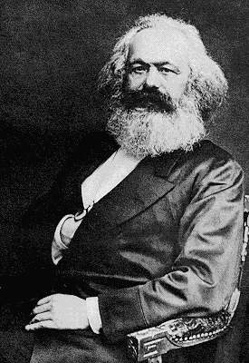

Frederick Engels\
Ludwig Feuerbach and the End of Classical German Philosophy

------------------------------------------------------------------------

### Part 4: Marx

------------------------------------------------------------------------

 

{border="1" width="275" align="right" hspace="12"}

Strauss, Bauer, Stirner, Feuerbach --- these were the offshoots of
Hegelian philosophy, in so far as they did not abandon the field of
philosophy. Strauss, after his *Life of Jesus* and *Dogmatics*, produced
only literary studies in philosophy and ecclesiastical history after the
fashion of Renan. Bauer only achieved something in the field of the
history of the origin of Christianity, though what he did here was
important. Stirner remained a curiosity, even after Bakunin blended him
with Proudhon and labelled the blend "anarchism". Feuerbach alone was of
significance as a philosopher. But not only did philosophy --- claimed
to soar above all special sciences and to be the science of sciences
connecting them --- remain to him an impassable barrier, an inviolable
holy thing, but as a philosopher, too, he stopped half-incapable of
disposing of Hegel through criticism; he simply threw him aside as
useless, while he himself, compared with the encyclopaedic wealth of the
Hegelian system, achieved nothing positive beyond a turgid religion of
love and a meagre, impotent morality.

[]{#001}Out of the dissolution of the Hegelian school, however, there
developed still another tendency, the only one which has borne real
fruit. And this tendency is essentially connected with the name of Marx
^[(1)](#1){#1b}^.

[]{#002}The separation from Hegelian philosophy was here also the result
of a return to the materialist standpoint. That means it was resolved to
comprehend the real world --- nature and history --- just as it presents
itself to everyone who approaches it free from preconceived idealist
crotchets. It was decided mercilessly to sacrifice every idealist fancy
which could not be brought into harmony with the facts conceived in
their own and not in a fantastic interconnection. And materialism means
nothing more than this. But here the materialistic world outlook was
taken really seriously for the first time and was carried through
consistently --- at least in its basic features --- in all domains of
knowledge concerned.

[]{#003}Hegel was not simply put aside. On the contrary, a start was
made from his revolutionary side, described above, from the dialectical
method. But in its Hegelian form, this method was unusable. According to
Hegel, dialectics is the self-development of the concept. The absolute
concept does not only exist --- unknown where --- from eternity, it is
also the actual living soul of the whole existing world. It develops
into itself through all the preliminary stages which are treated at
length in the *Logic* and which are all included in it. Then it
"alienates" itself by changing into nature, where, unconscious of
itself, disguised as a natural necessity, it goes through a new
development and finally returns as man's consciousness of himself. This
self-consciousness then elaborates itself again in history in the crude
form until finally the absolute concept again comes to itself completely
in the Hegelian philosophy. According to Hegel, therefore, the
dialectical development apparent in nature and history --- that is, the
causal interconnection of the progressive movement from the lower to the
higher, which asserts itself through all zigzag movements and temporary
retrogression --- is only a copy \[Abklatsch\] of the self-movement of
the concept going on from eternity, no one knows where, but at all
events independently of any thinking human brain. This ideological
perversion had to be done away with. We again took a materialistic view
of the thoughts in our heads, regarding them as images \[Abbilder\] of
real things instead of regarding real things as images of this or that
stage of the absolute concept. Thus dialectics reduced itself to the
science of the general laws of motion, both of the external world and of
human thought --- two sets of laws which are identical in substance, but
differ in their expression in so far as the human mind can apply them
consciously, while in nature and also up to now for the most part in
human history, these laws assert themselves unconsciously, in the form
of external necessity, in the midst of an endless series of seeming
accidents. Thereby the dialectic of concepts itself became merely the
conscious reflex of the dialectical motion of the real world and thus
the dialectic of Hegel was turned over; or rather, turned off its head,
on which it was standing, and placed upon its feet. And this materialist
dialectic, which for years has been our best working tool and our
sharpest weapon, was, remarkably enough, discovered not only by us but
also, independently of us and even of Hegel, by a German worker, Joseph
Dietzgen. ^[(2)](#2){#2b}^

[]{#004}In this way, however, the revolutionary side of Hegelian
philosophy was again taken up and at the same time freed from the
idealist trimmings which with Hegel had prevented its consistent
execution. The great basic thought that the world is not to be
comprehended as a complex of readymade *things*, but as a complex of
*processes*, in which the things apparently stable no less than their
mind images in our heads, the concepts, go through an uninterrupted
change of coming into being and passing away, in which, in spite of all
seeming accidentally and of all temporary retrogression, a progressive
development asserts itself in the end --- this great fundamental thought
has, especially since the time of Hegel, so thoroughly permeated
ordinary consciousness that in this generality it is now scarcely ever
contradicted. But to acknowledge this fundamental thought in words and
to apply it in reality in detail to each domain of investigation are two
different things. If, however, investigation always proceeds from this
standpoint, the demand for final solutions and eternal truths ceases
once for all; one is always conscious of the necessary limitation of all
acquired knowledge, of the fact that it is conditioned by the
circumstances in which it was acquired. On the other hand, one no longer
permits oneself to be imposed upon by the antithesis, insuperable for
the still common old metaphysics, between true and false, good and bad,
identical and different, necessary and accidental. One knows that these
antitheses have only a relative validity; that that which is recognized
now as true has also its latent false side which will later manifest
itself, just as that which is now regarded as false has also its true
side by virtue of which it could previously be regarded as true. One
knows that what is maintained to be necessary is composed of sheer
accidents and that the so-called accidental is the form behind which
necessity hides itself --- and so on.

[]{#005}The old method of investigation and thought which Hegel calls
"metaphysical", which preferred to investigate *things* as given, as
fixed and stable, a method the relics of which still strongly haunt
people's minds, had a great deal of historical justification in its day.
It was necessary first to examine things before it was possible to
examine processes. One had first to know what a particular thing was
before one could observe the changes it was undergoing. And such was the
case with natural science. The old metaphysics, which accepted things as
finished objects, arose from a natural science which investigated dead
and living things as finished objects. But when this investigation had
progressed so far that it became possible to take the decisive step
forward, that is, to pass on the systematic investigation of the changes
which these things undergo in nature itself, then the last hour of the
old metaphysic struck in the realm of philosophy also. And in fact,
while natural science up to the end of the last century was
predominantly a *collecting* science, a science of finished things, in
our century it is essentially a systematizing science, a science of the
processes, of the origin and development of these things and of the
interconnection which binds all these natural processes into one great
whole. Physiology, which investigates the processes occurring in plant
and animal organisms; embryology, which deals with the development of
individual organisms from germs to maturity; geology, which investigates
the gradual formation of the Earth's surface --- all these are the
offspring of our century.

[]{#006}But, above all, there are three great discoveries which have
enabled our knowledge of the interconnection of natural processes to
advance by leaps and bounds:

[]{#007}First, the discovery of the cell as the unit from whose
multiplication and differentiation the whole plant and animal body
develops. Not only is the development and growth of all higher organisms
recognized to proceed according to a single general law, but the
capacity of the cell to change indicates the way by which organisms can
change their species and thus go through a more than individual
development.

[]{#008}Second, the transformation of energy, which has demonstrated to
us that all the so-called forces operative in the first instance in
inorganic nature --- mechanical force and its complement, so-called
potential energy, heat, radiation (light, or radiant heat), electricity,
magnetism, and chemical energy --- are different forms of manifestation
of universal motion, which pass into one another in definite proportions
so that in place of a certain quantity of the one which disappears, a
certain quantity of another makes its appearance and thus the whole
motion of nature is reduced to this incessant process of transformation
from one form into another.

[]{#009}Finally, the proof which Darwin first developed in connected
form that the stock of organic products of nature environing us today,
including man, is the result of a long process of evolution from a few
originally unicellular germs, and that these again have arisen from
protoplasm or albumen, which came into existence by chemical means.

[]{#010}Thanks to these three great discoveries, and the other immense
advances in natural science, we have now arrived at the point where we
can demonstrate the interconnection between the processes in nature not
only in particular spheres but also the interconnection of these
particular spheres on the whole, and so can present in an approximately
systematic form a comprehensive view of the interconnection in nature by
means of the facts provided by an empirical science itself. To furnish
this comprehensive view was formerly the task of so-called natural
philosophy. It could do this only by putting in place of the real but as
yet unknown interconnections ideal, fancied ones, filling in the missing
facts by figments of the mind and bridging the actual gaps merely in
imagination. In the course of this procedure it conceived many brilliant
ideas and foreshadowed many later discoveries, but it also produced a
considerable amount of nonsense, which indeed could not have been
otherwise. Today, when one needs to comprehend the results of natural
scientific investigation only dialetically, that is, in the sense of
their own interconnection, in order to arrive at a "system of nature"
sufficient for our time; when the dialectical character of this
interconnection is forcing itself against their will even into the
metaphysically-trained minds of the natural scientists, today natural
philosophy is finally disposed of. Every attempt at resurrecting it
would be not only superfluous but a *step backwards*.

[]{#011}But what is true of nature, which is hereby recognized also as a
historical process of development, is likewise true of the history of
society in all its branches and of the totality of all sciences which
occupy themselves with things human (and divine). Here, too, the
philosophy of history, of right, of religion, etc., has consisted in the
substitution of an interconnection fabricated in the mind of the
philosopher for the real interconnection to be demonstrated in the
events; has consisted in the comprehension of history as a whole as well
as in its separate parts, as the gradual realization of ideas --- and
naturally always only the pet ideas of the philosopher himself.
According to this, history worked unconsciously but of necessity towards
a certain ideal goal set in advance --- as, for example, in Hegel,
towards the realization of his absolute idea --- and the unalterable
trend towards this absolute idea formed the inner interconnection in the
events of history. A new mysterious providence --- unconscious or
gradually coming into consciousness --- was thus put in the place of the
real, still unknown interconnection. Here, therefore, just as in the
realm of nature, it was necessary to do away with these fabricated,
artificial interconnections by the discovery of the real ones --- a task
which ultimately amounts to the discovery of the general laws of motion
which assert themselves as the ruling ones in the history of human
society.

[]{#012}In one point, however, the history of the development of society
proves to be essentially different from that of nature. In nature --- in
so far as we ignore man's reaction upon nature --- there are only blind,
unconscious agencies acting upon one another, out of whose interplay the
general law comes into operation. Nothing of all that happens ---
whether in the innumerable apparent accidents observable upon the
surface, or in the ultimate results which confirm the regularity
inherent in these accidents --- happens as a consciously desired aim. In
the history of society, on the contrary, the actors are all endowed with
consciousness, are men acting with deliberation or passion, working
towards definite goals; nothing happens without a conscious purpose,
without an intended aim. But this distinction, important as it is for
historical investigation, particularly of single epochs and events,
cannot alter the fact that the course of history is governed by inner
general laws. For here, also, on the whole, in spite of the consciously
desired aims of all individuals, accident apparently reigns on the
surface. That which is willed happens but rarely; in the majority of
instances the numerous desired ends cross and conflict with one another,
or these ends themselves are from the outset incapable of realization,
or the means of attaining them are insufficient. thus the conflicts of
innumerable individual wills and individual actions in the domain of
history produce a state of affairs entirely analogous to that prevailing
in the realm of unconscious nature. The ends of the actions are
intended, but the results which actually follow from these actions are
not intended; or when they do seem to correspond to the end intended,
they ultimately have consequences quite other than those intended.
Historical events thus appear on the whole to be likewise governed by
chance. But where on the surface accident holds sway, there actually it
is always governed by inner, hidden laws, and it is only a matter of
discovering these laws.

[]{#013}Men make their own history, whatever its outcome may be, in that
each person follows his own consciously desired end, and it is precisely
the resultant of these many wills operating in different directions, and
of their manifold effects upon the outer world, that constitutes
history. Thus it is also a question of what the many individuals desire.
The will is determined by passion or deliberation. But the levers which
immediately determine passion or deliberation are of very different
kinds. Partly they may be external objects, partly ideal motives,
ambition, "enthusiasm for truth and justice", personal hatred, or even
purely individual whims of all kinds. But, on the one hand, we have seen
that the many individual wills active in history for the most part
produce results quite other than those intended --- often quite the
opposite; that their motives, therefore, in relation to the total result
are likewise of only secondary importance. On the other hand, the
further question arises: What driving forces in turn stand behind these
motives? What are the historical forces which transform themselves into
these motives in the brains of the actors?

[]{#014}The old materialism never put this question to itself. Its
conception of history, in so far as it has one at all, is therefore
essentially pragmatic; it divides men who act in history into noble and
ignoble and then finds that as a rule the noble are defrauded and the
ignoble are victorious. hence, it follows for the old materialism that
nothing very edifying is to be got from the study of history, and for us
that in the realm of history the old materialism becomes untrue to
itself because it takes the ideal driving forces which operate there as
ultimate causes, instead of investigating what is behind them, what are
the driving forces of these driving forces. This inconsistency does not
lie in the fact that *ideal* driving forces are recognized, but in the
investigation not being carried further back behind these into their
motive causes. On the other hand, the philosophy of history,
particularly as represented by Hegel, recognizes that the ostensible and
also the really operating motives of men who act in history are by no
means the ultimate causes of historical events; that behind these
motives are other motive powers, which have to be discovered. But it
does not seek these powers in history itself, it imports them rather
from outside, from philosophical ideology, into history. Hegel, for
example, instead of explaining the history of ancient Greece out of its
own inner interconnections, simply maintains that it is nothing more
than the working out of "forms of beautiful individuality", the
realization of a "work of art" as such. He says much in this connection
about the old Greeks that is fine and profound, but that does not
prevent us today from refusing to be put off with such an explanation,
which is a mere manner of speech.

[]{#015}When, therefore, it is a question of investigating the driving
powers which --- consciously or unconsciously, and indeed very often
unconsciously --- lie behind the motives of men who act in history and
which constitute the real ultimate driving forces of history, then it is
not a question so much of the motives of single individuals, however
eminent, as of those motives which set in motion great masses, whole
people, and again whole classes of the people in each people; and this,
too, not merely for an instant, like the transient flaring up of a
straw-fire which quickly dies down, but as a lasting action resulting in
a great historical transformation. To ascertain the driving causes which
here in the minds of acting masses and their leaders --- to so-called
great men --- are reflected as conscious motives, clearly or unclearly,
directly or in an ideological, even glorified, form --- is the only path
which can put us on the track of the laws holding sway both in history
as a whole, and at particular periods and in particular lands.
Everything which sets men in motion must go through their minds; but
what form it will take in the mind will depend very much upon the
circumstances. The workers have by no means become reconciled to
capitalist machine industry, even though they no longer simply break the
machines to pieces, as they still did in 1848 on the Rhine.

[]{#016}But while in all earlier periods the investigation of these
driving causes of history was almost impossible --- on account of the
complicated and concealed interconnections between them and their
effects --- our present period has so far simplified these
interconnections that the riddle could be solved. Since the
establishment of large-scale industry --- that is, at least since the
European peace of 1815 --- it has been no longer a secret to any man in
England that the whole political struggle there pivoted on the claims to
supremacy of two classes: the landed aristocracy and the bourgeoisie
(middle class). In France, with the return of the Bourbons, the same
fact was perceived, the historians of the Restoration period, from
Thierry to Guisot, Mignet, and Thiers, speak of it everywhere as the key
to the understanding of all French history since the Middle Ages. And
since 1830, the working class, the proletariat, has been recognized in
both countries as a third competitor for power. Conditions had become so
simplified that one would have had to close one's eyes deliberately not
to see in the light of these three great classes and in the conflict of
their interests the driving force of modern history --- at least in the
two most advanced countries.

[]{#017}But how did these classes come into existence? If it was
possible at first glance still to ascribe the origin of the great,
formerly feudal landed property --- at least in the first instance ---
to political causes, to taking possession by force, this could not be
done in regard to the bourgeoise and the proletariat. Here, the origin
and development of two great classes was seen to lie clearly and
palpably in purely economic causes. And it was just as clear that in the
struggle between landed property and the bourgeoisie, no less than in
the struggle between the bourgeoisie and the proletariat, it was a
question, first and foremost, of economic interests, to the furtherance
of which political power was intended to serve merely as a means.
Bourgeoisie and proletariat both arose in consequences of a
transformation of the economic conditions, more precisely, of the mode
of production. The transition, first from guild handicrafts to
manufacture, and then from manufacture to large-scale industry, with
steam and mechanical power, had caused the development of these two
classes. At a certain stage, the new productive forces set in motion by
the bourgeoisie --- in the first place the division of labor and the
combination of many detail laborers \[Teilarbeiter\] in one general
manufactory --- and the conditions and requirements of exchange,
developed through these productive forces, became incompatible with the
existing order of production handed down by history and sanctified by
law --- that is to say, incompatible with the privileges of the guild
and the numerous other personal and local privileges (which were only so
many fetters to the unprivileged estates) of the feudal order to
society. The productive forces represented by the bourgeoisie rebelled
against the order of production represented by the feudal landlords and
the guild-masters. The result is known, the feudal fetters were smashed,
gradually in England, at one blow in France. In Germany, the process is
not yet finished. But just as, at a definite stage of its development,
manufacture came into conflict with the feudal order of production, so
now large-scale industry has already come into conflict with the
bourgeois order or production established in its place.Tied down by this
order, by the narrow limits of the capitalist mode of production, this
industry produces, on the one hand, an ever-increasingly
proletarianziation of the great mass of the people, and on the other
hand, an ever greater mass of unsalable products. Overproduction and
mass misery, each the cause of the other --- that is the absurd
contradiction which is its outcome, and which of necessity calls for the
liberation of the productive forces by means of a change in the mode of
production.

[]{#018}In modern history at least it is, therefore, proved that all
political struggles are class struggles, and all class struggles for
emancipation, despite their necessarily political form --- for every
class struggle is a political struggle --- turn ultimately on the
question of *economic* emancipation. Therefore, here at least, the state
--- the political order --- is the subordination, and civil society ---
the realm of economic relations --- the decisive element. The
traditional conception, to which Hegel, too, pays homage, saw in the
state the determining element, and in civil society the element
determined by it. Appearances correspond to this. As all the driving
forces of the actions of any individual person must pass through his
brain, and transform themselves into motives of his will in order to set
him into action, so also all the needs of civil society --- no matter
which class happens to be the ruling one --- must pass through the will
of the state in order to secure general validity in the form of laws.
That is the formal aspect of the matter --- the one which is
self-evident. The question arises, however, what is the content of this
merely formal will --- of the individual as well as of the state --- and
whence is this content derived? Why is just this willed and not
something else? If we enquire into this, we discover that in modern
history the will of the state is, on the whole, determined by the
changing needs of civil society, but the supremacy of this or that
class, in the last resort, by the development of the productive forces
and relations of exchange.

[]{#019}But if even in our modern era, with its gigantic means of
production and communication, the state is not an independent domain
with an independent development, but one whose existence as well as
development is to be explained in the last resort by the economic
conditions of life of society, then this must be still more true of all
earlier times when the production of the material life of man was not
yet carried on with these abundant auxiliary means, and when, therefore,
the necessity of such production must have exercised a still greater
mastery over men. If the state even today, in the era of big industry
and of railways, is on the whole only a reflection, in concentrated
form, of the economic needs of the class controlling production, then
this must have been much more so in an epoch when each generation of men
was forced to spend a far greater part of its aggregate lifetime in
satisfying material needs, and was therefore much more dependent on them
than we are today. An examination of the history of earlier periods, as
soon as it is seriously undertaken from this angle, most abundantly
confirms this. But, of course, this cannot be gone into here.

[]{#020}If the state and public law are determined by economic
relations, so, too, of course, is private law, which indeed in essence
only sanctions the existing economic relations between individuals which
are normal in the given circumstances. The form in which this happens
can, however, vary considerably. It is possible, as happened in England,
in harmony with the whole national development, to retain in the main
the forms of the old feudal laws while giving them a bourgeois content;
in fact, directly reading a bourgeois meaning into the feudal name. But,
also, as happened in Western continental Europe, roman law, the first
world law of a commodity-producing society, with its unsurpassably fine
elaboration of all the essential legal relations of simple commodity
owners (of buyers and sellers, debtors and creditors, contracts,
obligations, etc.) can be taken as the foundation. In which case, for
the benefit of a still petty-bourgeois and semi-feudal society, it can
either be reduced to the level of such a society simply through judicial
practice (common law) or, with the help of allegedly enlightened,
moralizing jurists it can be worked into a special code of law to
correspond with such social level --- a code which in these
circumstances will be a bad one also from the legal standpoint (for
instance, Prussian Landrecht). But after a great bourgeois revolution it
is, however, also possible for such a classic law code of bourgeois
society as the French *Code Civile* to be worked out upon the basis of
this same Roman Law. If, therefore, bourgeois legal rules merely express
the economic life conditions of society in legal form, then they can do
so well or ill according to circumstances.

[]{#021}The state presents itself to us as the first ideological power
over man. Society creates for itself an organ for the safeguarding of
its common interests against internal and external attacks. This organ
is the state power. Hardly come into being, this organ makes itself
independent vis-a-vis society; and, indeed, the more so, the more it
becomes the organ of a particular class, the more it directly enforces
the supremacy of that class. The fight of the oppressed class against
the ruling class becomes necessarily a political fight, a fight first of
all against the political dominance of this class. The consciousness of
the interconnection between this political struggle and its economic
basis becomes dulled and can be lost altogether. While this is not
wholly the case with the participants, it almost always happens with the
historians. Of the ancient sources on the struggles within the Roman
Republic, only Appian tells us clearly and distinctly what was at issue
in the last resort --- namely, landed property.

[]{#022}But once the state has become an independent power vis-a-vis
society, it produces forthwith a further ideology. It is indeed among
professional politicians, theorists of public law, and jurists of
private law, that the connection with economic facts gets lost for fair.
Since in each particular case, the economic facts must assume the form
of juristic motives in order to receive legal sanction; and since, in so
doing, consideration of course has to be given to the whole legal system
already in operation, the juristic form is, in consequence, made
everything and the economic content nothing. Public law and private law
are treated as independent spheres, each being capable of and needing a
systematic presentation by the consistent elimination of all inner
contradictions.

[]{#023}Still higher ideologies, that is, such as are still further
removed from the material, economic basis, take the form of philosophy
and religion. Here the interconnection between conceptions and their
material conditions of existence becomes more and more complicated, more
and more obscured by intermediate links. But the interconnection exists.
Just as the whole Renaissance period, from the middle of the 15th
century, was an essential product of the towns and, therefore, of the
burghers, so also was the subsequently newly-awakened philosophy. Its
content was in essence only the philosophical expression of the thoughts
corresponding to the development of the small and middle burghers into a
big bourgeoisie. Among last century's Englishmen and Frenchmen who in
many cases were just as much political economists as philosophers, this
is clearly evident; and we have proved it above in regard to the
Hegelian school.

[]{#024}We will now in addition deal only briefly with religion, since
the latter stands further away from material life and seems to be most
alien to it. Religion arose in very primitive times from erroneous,
primitive conceptions of men about their own nature and external nature
surrounding them. Every ideology, however, once it has arisen, develops
in connection with the given concept-material, and develops this
material further; otherwise, it would not be an ideology, that is,
occupation with thoughts as with independent entities, developing
independently and subject only to their own laws. In the last analysis,
the material life conditions of the persons inside whose heads this
thought process goes on determine the course of the process, which of
necessity remains unknown to these persons, for otherwise there would be
an end to all ideology. These original religious notions, therefore,
which in the main are common to each group of kindred peoples, develop,
after the group separates, in a manner peculiar to each people,
according to the conditions of life falling to their lot. For a number
of groups of peoples, and particularly for the Aryans (so-called
Indo-Europeans) this process has been shown in detail by comparative
mythology. The gods thus fashioned within each people were national
gods, whose domain extended no farther than the national territory which
they were to protect; on the other side of its boundaries, other gods
held undisputed sway. They could continue to exist, in imagination, only
as long as the nation existed; they fell with its fall. The Roman world
empire, the economic conditions of whose origin we do not need to
examine here, brought about this downfall of the old nationalities. The
old national gods decayed, even those of the Romans, which also were
patterned to suit only the narrow confines of the city of Rome. The need
to complement the world empire by means of a world religion was clearly
revealed in the attempts made to recognize all foreign gods that were
the least bit respectable and provide altars for them in Rome alongside
the native gods. But a new world religion is not to be made in this
fashion, by imperial decree. The new world religion, Christianity, had
already quietly come into being, out of a mixture of generalized
Oriental, particularly Jewish, theology, and vulgarized Greek,
particularly Stoic, philosophy. What it originally looked like has to be
first laboriously discovered, since its official form, as it has been
handed down to us, is merely that in which it became the state religion
to which purpose it was adapted by the Council of Nicaea. The fact that
already after 250 years it became the state religion suffices to show
that it was the religion in correspondence with the conditions of the
time. In the Middle Ages, in the same measure as feudalism developed,
Christianity grew into the religious counterpart to it, with a
corresponding feudal hierarchy. And when the burghers began to thrive,
there developed, in opposition to feudal Catholicism, the Protestant
heresy, which first appeared in Southern France among the
Albigenses^[\[A\]](#A){#Ab}^, at the time the cities there reached the
highest point of their florescence. The Middle Ages had attached to
theology all the other forms of ideology --- philosophy, politics,
jurisprudence --- and made them subdivision of theology. It thereby
constrained every social and political movement to take on a theological
form. The sentiments of the masses were fed with religion to the
exclusion of all else; it was therefore necessary to put forward their
own interests in a religious guise in order to produce a great tempest.
And just as the burghers from the beginning brought into being an
appendage of propertyless urban plebeians, day laborers and servants of
all kinds, belonging to no recognized social estate, precursors of the
later proletariat, so likewise heresy soon became divided into a
burgher-moderate heresy and a plebeian-revolutionary one, the latter an
abomination to the burgher heretics themselves.

[]{#025}The ineradicability of the Protestant heresy corresponded to the
invincibility of the rising burghers. When these burghers had become
sufficiently strengthened, their struggle against the feudal nobility,
which till then had been predominantly local, began to assume national
dimensions. The first great action occurred in Germany --- the so-called
reformation. The burghers were neither powerful enough nor sufficiently
developed to be able to unite under their banner the remaining
rebellious estates --- the plebeians of the towns, the lower nobility,
and the peasants on the land. At first, the nobles were defeated; the
peasants rose in a revolt which formed the peak of the whole
revolutionary struggle; the cities left them in the lurch, and thus the
revolution succumbed to the armies of the secular princes who reaped the
whole profit. Thenceforward, Germany disappears for three centuries from
the ranks of countries playing an independent active part in history.
But, beside the German Luther appeared the Frenchman Calvin. With true
French acuity, he put the bourgeois character of the Reformation in the
forefront, republicanized and democratized the Church. While the
Lutheran Reformation in Germany degenerated and reduced the country to
rack and ruin, the Calvinist Reformation served as a banner for the
republicans in Geneva, in Holland, and in Scotland, freed Holland from
Spain and from the German Empire, and provided the ideological costume
for the second act of the bourgeois revolution, which was taking place
in England. Here, Calvinism justified itself as the true religious
disguise of the interests of the bourgeoisie of that time, and on this
account did not attain full recognition when the revolution ended in
1689 in a compromise between one part of the nobility and the
bourgeoisie. The English state Church was re-established; but not in its
earlier form of a Catholicism which had the king for its pope, being,
instead, strongly Calvinized. The old state Church had celebrated the
merry Catholic Sunday and had fought against the dull Calvinist one. The
new, bourgeoisified Church introduced the latter, which adorns England
to this day.

[]{#026}In France, the Calvinist minority was suppressed in 1685 and
either Catholized or driven out of the country. But what was the good?
Already at that time the freethinker Pierre Bayle was at the height of
his activity, and in 1694 Voltaire was born. The forcible measures of
Louis XIV only made it easier for the French bourgeoisie to carry
through its revolution in the irreligious, exclusively political form
which alone was suited to a developed bourgeoisie. Instead of
Protestants, freethinkers took their seats in the national assemblies.
Thereby Christianity entered into its final stage. It was incapable of
doing any future service to any progressive class as the ideological
garb of its aspirations. It became more and more the exclusive
possession of the ruling classes; they apply it as a mere means of
government, to keep the lower classes within bounds. Moreover, each of
the different classes uses its own appropriate religion: the landed
nobility --- Catholic Jesuitism, or Protestant orthodoxy; the liberal
and radical bourgeoisie --- rationalism; and it makes little difference
whether these gentlemen themselves believe in their respective religions
or not.

[]{#027}We see, therefore: religion, once formed, always contains
traditional material, just as in all ideological domains tradition forms
a great conservative force. But the transformations which this material
undergoes spring from class relations --- that is to say, out of the
economic relations of the people who execute these transformations. And
here that is sufficient.

[]{#028}In the above, it could only be a question of giving a general
sketch of the Marxist conception of history, at most with a few
illustrations, as well. The proof must be derived from history itself;
and, in this regard, it may be permitted to say that is has been
sufficiently furnished in other writings. This conception, however, puts
an end to philosophy in the realm of history, just as the dialectical
conception of nature makes all natural philosophy both unnecessary and
impossible. It is no longer a question anywhere of inventing
interconnections from out of our brains, but of discovering them in the
facts. For philosophy, which has been expelled from nature and history,
there remains only the realm of pure thought, so far as it is left: the
theory of the laws of the thought process itself, logic and dialectics.

------------------------------------------------------------------------

 

[]{#029}With the Revolution of 1848, "educated" Germany said farewell to
theory and went over to the field of practice. Small production and
manufacture, based upon manual labor, were superseded by real
large-scale industry. Germany again appeared on the world market. The
new little German Empire ^[\[B\]](#B){#Bb}^ abolished at least the most
crying of the abuses with which this development had been obstructed by
the system of petty states, the relics of feudalism, and bureaucratic
management. But to the same degree that speculation abandoned the
philosopher's study in order to set up its temple in the Stock Exchange,
educated Germany lost the great aptitude for theory which had been the
glory of Germany in the days of its deepest political humiliation ---
the aptitude for purely scientific investigation, irrespective of
whether the result obtained was practically applicable or not, whether
likely to offend the police authorities or not. Official German natural
science, it is true, maintained its position in the front rank,
particularly in the field of specialized research. But even the American
journal *Science* rightly remarks that the decisive advances in the
sphere of the comprehensive correlation of particular facts and their
generalization into laws are now being made much more in England,
instead of, as formerly, in Germany. And in the sphere of the historical
sciences, philosophy included, the old fearless zeal for theory has now
disappeared completely, along with classical philosophy. Inane
eclecticism and an anxious concern for career and income, descending to
the most vulgar job-hunting, occupy its place. The official
representatives of these sciences have become the undisguised
ideologists of the bourgeoisie and the existing state --- but at a time
when both stand in open antagonism to the working class.

[]{#030}Only among the working class does the German aptitude for theory
remain unimpaired. Here, it cannot be exterminated. Here, there is no
concern for careers,for profit-making, or for gracious patronage from
above. On the contrary, the more ruthlessly and disinterestedly science
proceeds the more it finds itself in harmony with the interest and
aspirations of the workers. The new tendency, which recognized that the
key to the understanding of the whole history of society lies in the
history of the development of labor, from the outset addressed itself by
preference to the working class and here found the response which it
neither sought nor expected from officially recognized science. The
German working-class movement is the inheritor of German classical
philosophy.

 

------------------------------------------------------------------------

 

^[(1)](#1b){#1}^ Here I may be permitted to make a personal explanation.
Lately repeated reference has been made to my share in this theory, and
so I can hardly avoid saying a few words here to settle this point. I
cannot deny that both before and during my 40 years' collaboration with
Marx I had a certain independent share in laying the foundation of the
theory, and more particularly in its elaboration. But the greater part
of its leading basic principles, especially in the realm of economics
and history, and, above all, their final trenchant formulation, belong
to Marx. What I contributed --- at any rate with the exception of my
work in a few special fields --- Marx could very well have done without
me. What Marx accomplished I would not have achieved. Marx stood higher,
saw further, and took a wider and quicker view than all the rest of us.
Marx was a genius; we others were at best talented. Without him the
theory would not be by far what it is today. If therefore rightly bears
his name.

^[(2)](#2b){#2}^ See *Das Wesen der menschlichen Kopfarbeit, dargestellt
von einem Handarbeiter* \[The Nature of Human Brainwork, Described by a
Manual Worker\]. Hamburg, Meissner.

^[\[A\]](#Ab){#A}^ Albingenses: A religious sect which, during the 12th
and 13th centuries, directed a movement against the Roman Catholic
Church. The name is derived from the town of Albi, in the south of
France.

^[\[B\]](#Bb){#B}^ "The new little German Empire": This term is applied
to the German Empire without Austria, which arose in 1871, under
Prussian hegemony.

[]{#031}[]{#032}Table of Contents: [Ludwig Feuerbach and the End of
Classical German Philosophy](index.htm)
