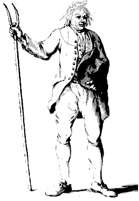

[]{#1}

Works of Frederick Engels 1894

{align="right" hspace="10"
vspace="2" border="0" width="275" height="396"}

# The Peasant Question in France and Germany

------------------------------------------------------------------------

[Source:]{.info} Volume 3 of the *Selected Works*;\
[Written:]{.info} between November 15-22, 1894;\
[First Published:]{.info} in *Die Neue Zeit*, 1894-95;\
[Translated:]{.info} by Progress Publishers;\
[Transcribed:]{.info} by director@marx.org, October 1993.

------------------------------------------------------------------------

Engels\' *The Peasant Question in France and Germany* was part of the
current debate around agrarian issues. Engels wrote it as rebuttal to
various French Socialists (like Vollmar) and the agrarian programme
adopted in Marseilles in 1892 and supplemented in Nantes in 1894
(Frankfurt Congress of German Social-Democrats). In it, Engels discusses
a policy of alliance between the working class and the working
peasantry.

------------------------------------------------------------------------

[Preface](preface.htm)

Part 1: [France](ch01.htm)

Part 2: [Germany](ch02.htm)

 

------------------------------------------------------------------------

[]{#works}

Works on Pre-Capitalist Social Formations and the Peasantry\
\
[The Peasant Question in France and Germany](#1), Engels 1894\
[Afterword to 'On Social Relations in
Russia'](../../1894/01/russia.htm), Engels 1894\
[On The History of Early
Christianity](../../1894/early-christianity/index.htm), Engels 1894\
[Origin of the Family, etc.](../../1884/origin-family/index.htm), Engels
1884\
[Letter to Vera Zasulich](../../1881/zasulich/index.htm), Marx 1881\
[Transition from Ape to Man](../../1876/part-played-labour/index.htm),
Engels 1876\
[On Social Relations in Russia](../../1874/refugee-literature/ch05.htm),
Engels 1874\
[Precapitalist Economic Formations](../../1857/precapitalist/index.htm),
Marx 1857\
[The Peasant War in Germany](../../1850/peasant-war-germany/index.htm),
Engels 1850\
\
[The German Ideology](../../1845/german-ideology/ch01.htm), Marx &
Engels 1845\
\

 

------------------------------------------------------------------------

[Subject Archive on Precapitalist
formations](../../subject/precapitalist/index.htm)\
[Marx Engels Archive](../../../index.htm)
